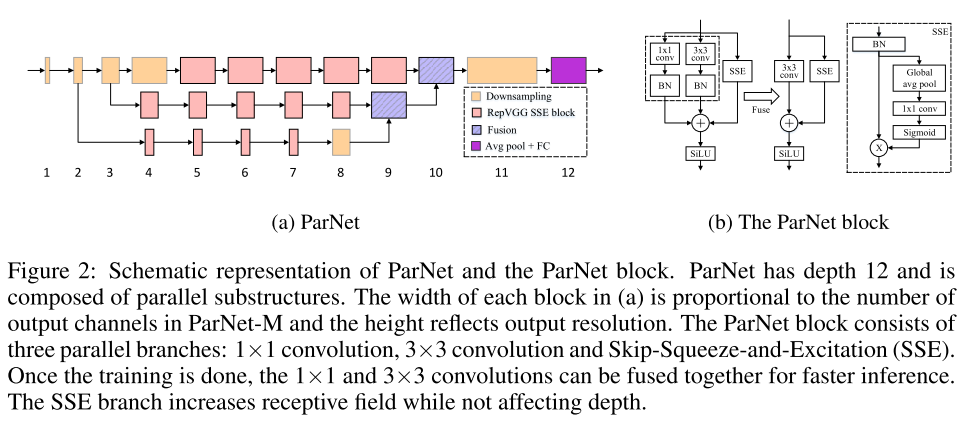
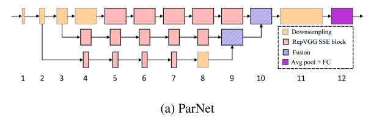
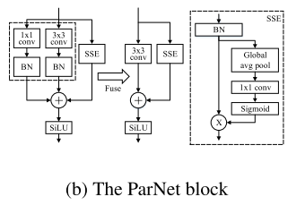
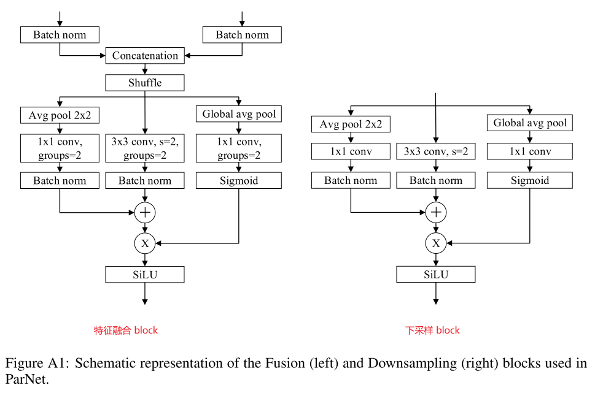

# NON-DEEP NETWORKS

使用并行子网络，而不是一层接一层地堆叠。这有助于在保持高性能的同时有效地降低深度。我们分析了我们设计的缩放规则，并展示了如何在不改变网络深度的情况下提高性能。最后，我们提供了如何使用非深度网络来构建低延迟识别系统的概念证明。

> 通过利用并行子结构，我们首次表明，一个深度仅为 12 的网络可以在 ImageNet 上达到超过 80% 的 Top1 准确率，在 CIFAR10 上达到 96%，在 CIFAR100 上达到 81%。我们还表明，一个具有低深度（12）主干的网络可以在 MS-COCO 上达到 48% 的 AP。

## 介绍

普遍认为，大深度是高性能网络的一个重要组成部分，因为深度增加了网络的表征能力，并有助于学习越来越抽象的特征。事实上，ResNets 成功的主要原因之一是，它们允许训练多达1000层的非常深的网络

但是，**大的深度总是必要的吗**？更深层次的网络会导致更多的顺序处理和更高的延迟；很难并行化，也不太适合用于需要快速响应的应用程序。

我们提出了一个非深度的网络设计。我们将我们的架构称为 ParNet（并行网络）。ParNet 中的参数数量与最先进的模型相当。

一个关键设计选择是使用并行子网络。 我们不是按顺序排列层，而是在并行子网络中排列层。 这种设计是“令人尴尬的平行”，因为**除了开始和结束之外，子网络之间没有连接**。 这允许我们在保持高精度的同时减少网络的深度。 值得注意的是，我们的平行结构不同于通过增加一层神经元的数量来“拓宽”网络。 

可以在保持深度不变的同时，通过增加分支的宽度、分辨率和数量来有效地缩放。 我们观察到PARNET的性能并不饱和，而是随着计算吞吐量的增加而增加。 这表明，通过进一步增加计算量，可以在保持小深度(±10)和低延迟的同时实现更高的性能。 

## 相关工作

### 深度的重要性

Cybenko 等人的经典之作表明具有 Sigmoid 激活的单层神经网络可以以任意小的误差逼近任何函数，但是必须足够宽。随后的工作表明，为了逼近一个函数，具有非线性的深度网络需要的参数比其浅层网络要少得多。  

以往的工作只研究了具有线性、顺序结构的浅层网络，并且不清楚这一结论是否仍然适用于其他可替代的设计。 在这项工作中，我们表明，一个浅网络可以表现得惊人地好，关键是有平行的子结构。 

### 可缩放的CNN

Tan&le(2019)表明，增加深度、宽度和分辨率导致卷积网络的有效缩放。

 Zagoruyko&Komodakis(2016)表明，宽度较大的浅层网络可以获得与较深的ResNets相似的性能。

### 多流网络

 HRNET架构在整个前向传递过程中保持多分辨率流（Wang et al.，2020)； 这些流定期融合在一起以交换信息。 

我们也使用不同分辨率的流，但是我们的网络要浅得多，并且流只在最后融合一次，使得并行化更容易。 

## 方法

 PARNET由处理不同分辨率特征的并行子结构组成。 我们把这些并行子结构称为流。 

来自不同流的特征在网络的后期被融合，这些融合的特征被用于下游任务。 

### Block 设计

我们使用 VGG 风格的 block（可以保证输入输出的特征图大小不变）

(1) VGG 风格的 block 比 ResNet 风格的 block 更适合非深度网络，但是需要使用“结构重新参数化”技术

(2) 借用 SENet 的思想，但是只使用一层 FC 层

(3) 使用 SiLU 代替 ReLU

### 下采样和块融合

下采样块降低分辨率并增加宽度以实现多尺度处理，而融合块组合来自多分辨率的信息。 

### 网络架构

(1) 3 个流是最优的

(2) 每个流的图像分辨率不同，最后再进行特征融合

> CIFAR 数据集因为分辨率较小，会进行简化处理

