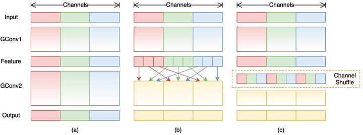

# CNN模型之ShuffleNet

> 原文链接：https://zhuanlan.zhihu.com/p/32304419

## 引言

ShuffleNet是旷视科技最近提出的一种计算高效的CNN模型，其和MobileNet和SqueezeNet等一样主要是想应用在移动端。所以，ShuffleNet的设计目标也是如何利用有限的计算资源来达到最好的模型精度，这需要很好地在速度和精度之间做平衡。ShuffleNet的核心是采用了两种操作：pointwise group convolution和channel shuffle，这在保持精度的同时大大降低了模型的计算量。目前移动端CNN模型主要设计思路主要是两个方面：模型结构设计和模型压缩。ShuffleNet和MobileNet一样属于前者，都是通过设计更高效的网络结构来实现模型变小和变快，而不是对一个训练好的大模型做压缩或者迁移。下面我们将详细讲述ShuffleNet的设计思路，网络结构及模型效果，最后使用Pytorch来实现ShuffleNet网络。

## 设计理念

ShuffleNet的核心设计理念是对不同的channels进行shuffle来解决group convolution带来的弊端。Group convolution是将输入层的不同特征图进行分组，然后采用不同的卷积核再对各个组进行卷积，这样会降低卷积的计算量。因为一般的卷积都是在所有的输入特征图上做卷积，可以说是全通道卷积，这是一种通道密集连接方式（channel dense connection）。而group convolution相比则是一种通道稀疏连接方式（channel sparse connection）。使用group convolution的网络如Xception，MobileNet，ResNeXt等。Xception和MobileNet采用了depthwise convolution，这其实是一种比较特殊的group convolution，因此此时分组数恰好等于通道数，意味着每个组只有一个特征图。但是这些网络存在一个很大的弊端是采用了密集的1x1卷积，或者说是dense pointwise convolution，这里说的密集指的是卷积是在所有通道上进行的。所以，实际上比如ResNeXt模型中1x1卷积基本上占据了93.4%的乘加运算。那么不如也对1x1卷积采用channel sparse connection，那样计算量就可以降下来了。但是group convolution存在另外一个弊端，如图1-a所示，其中GConv是group convolution，这里分组数是3。可以看到当堆积GConv层后一个问题是不同组之间的特征图是不通信的，这就好像分了三个互不相干的路，大家各走各的，这目测会降低网络的特征提取能力。这样你也可以理解为什么Xception，MobileNet等网络采用密集的1x1卷积，因为要保证group convolution之后不同组的特征图之间的信息交流。但是达到上面那个目的，我们不一定非要采用dense pointwise convolution。如图1-b所示，你可以对group convolution之后的特征图进行“重组”，这样可以保证接下了采用的group convolution其输入来自不同的组，因此信息可以在不同组之间流转。这个操作等价于图2-c，即group convolution之后对channels进行shuffle，但并不是随机的，其实是“均匀地打乱”。在程序上实现channel shuffle是非常容易的：假定将输入层分为 $g$ 组，总通道数为 $gn$  ，首先你将通道那个维度拆分为 $(g, n)$ 两个维度，然后将这两个维度转置变成  $(n, g)$，最后重新reshape成一个维度。如果你不太理解这个操作，你可以试着动手去试一下，发现仅需要简单的维度操作和转置就可以实现均匀的shuffle。利用channel shuffle就可以充分发挥group convolution的优点，而避免其缺点。



图1 使用channel shuffle后的group convolution

## 网络结构

基于上面的设计理念，首先来构造ShuffleNet的基本单元，如图2所示。ShuffleNet的基本单元是在一个残差单元的基础上改进而成的。如图2-a所示，这是一个包含3层的残差单元：首先是1x1卷积，然后是3x3的depthwise convolution（DWConv，主要是为了降低计算量），这里的3x3卷积是瓶颈层（bottleneck），紧接着是1x1卷积，最后是一个短路连接，将输入直接加到输出上。现在，进行如下的改进：将密集的1x1卷积替换成1x1的group convolution，不过在第一个1x1卷积之后增加了一个channel shuffle操作。值得注意的是3x3卷积后面没有增加channel shuffle，按paper的意思，对于这样一个残差单元，一个channel shuffle操作是足够了。还有就是3x3的depthwise convolution之后没有使用ReLU激活函数。改进之后如图2-b所示。对于残差单元，如果stride=1时，此时输入与输出shape一致可以直接相加，而当stride=2时，通道数增加，而特征图大小减小，此时输入与输出不匹配。一般情况下可以采用一个1x1卷积将输入映射成和输出一样的shape。但是在ShuffleNet中，却采用了不一样的策略，如图2-c所示：对原输入采用stride=2的3x3 avg pool，这样得到和输出一样大小的特征图，然后将得到特征图与输出进行连接（concat），而不是相加。这样做的目的主要是降低计算量与参数大小。


图2 ShuffleNet的基本单元

基于上面改进的ShuffleNet基本单元，设计的ShuffleNet模型如表1所示。可以看到开始使用的普通的3x3的卷积和max pool层。然后是三个阶段，每个阶段都是重复堆积了几个ShuffleNet的基本单元。对于每个阶段，第一个基本单元采用的是stride=2，这样特征图width和height各降低一半，而通道数增加一倍。后面的基本单元都是stride=1，特征图和通道数都保持不变。对于基本单元来说，其中瓶颈层，就是3x3卷积层的通道数为输出通道数的1/4，这和残差单元的设计理念是一样的。不过有个细节是，对于stride=2的基本单元，由于原输入会贡献一部分最终输出的通道数，那么在计算1/4时到底使用最终的通道数，还是仅仅未concat之前的通道数。文章没有说清楚，但是个人认为应该是后者吧。其中 $g$ 控制了group convolution中的分组数，分组越多，在相同计算资源下，可以使用更多的通道数，所以   $g$ 越大时，采用了更多的卷积核。这里给个例子，当  $g=3$ 时，对于第一阶段的第一个基本单元，其输入通道数为24，输出通道数为240，但是其stride=2，那么由于原输入通过avg pool可以贡献24个通道，所以相当于左支只需要产生240-24=216通道，中间瓶颈层的通道数就为216/4=54。其他的可以以此类推。当完成三阶段后，采用global pool将特征图大小降为1x1，最后是输出类别预测值的全连接层。


表1 ShuffleNet网络结构

## 模型效果

那么ShuffleNet的模型效果如何呢？表2给出了采用不同的$g$值的ShuffleNet在ImageNet上的实验结果。可以看到基本上当$g$越大时，效果越好，这是因为采用更多的分组后，在相同的计算约束下可以使用更多的通道数，或者说特征图数量增加，网络的特征提取能力增强，网络性能得到提升。注意Shuffle 1x是基准模型，而0.5x和0.25x表示的是在基准模型上将通道数缩小为原来的0.5和0.25。

表2 采用不同g值的ShuffleNet的分类误差

除此之外，作者还对比了不采用channle shuffle和采用之后的网络性能对比，如表3所示。可以清楚的看到，采用channle shuffle之后，网络性能更好，从而证明channle shuffle的有效性。


表3 不采用channle shuffle和采用之后的网络性能对比

然后是ShuffleNet与MobileNet的对比，如表4所示。可以看到ShuffleNet不仅计算复杂度更低，而且精度更好。


表4 ShuffleNet与MobileNet对比

ShuffleNet与其他CNN网络的对比可以去原始paper中更深入的了解。

## channle shuffle的Pytorch实现

channle shuffle操作代码：

```python
def shuffle_channels(x, groups):
    """shuffle channels of a 4-D Tensor"""
    batch_size, channels, height, width = x.size()
    assert channels % groups == 0
    channels_per_group = channels // groups
    # split into groups
    x = x.view(batch_size, groups, channels_per_group, height, width)
    # transpose 1, 2 axis
    x = x.transpose(1, 2).contiguous()
    # reshape into orignal
    x = x.view(batch_size, channels, height, width)
    return x
```

## 总结

本文主要介绍了ShuffleNet的核心设计思路以及网络架构，最后使用Pytorch来实现。说点题外话，在之前计算力不足时，CNN模型有时会采用group convolution，而随着计算力的提升，目前大部分的CNN采用dense channle connections，但是现在一些研究又转向了group convolution来提升速度，这有点戏剧化。不过ShuffleNet通过channle shuffle这一个trick解决了group convolution的一个副作用，还是值得称赞的。