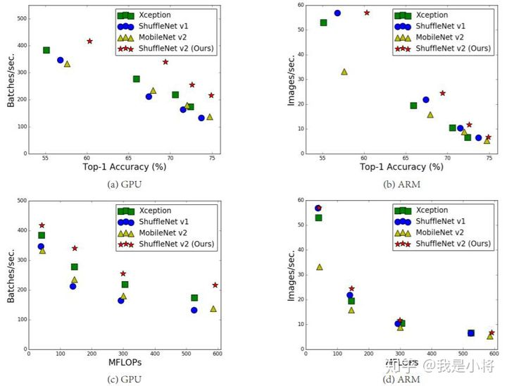
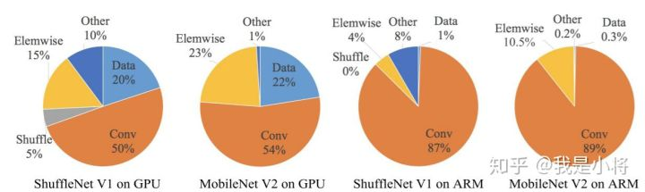
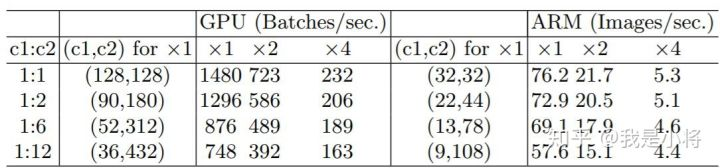
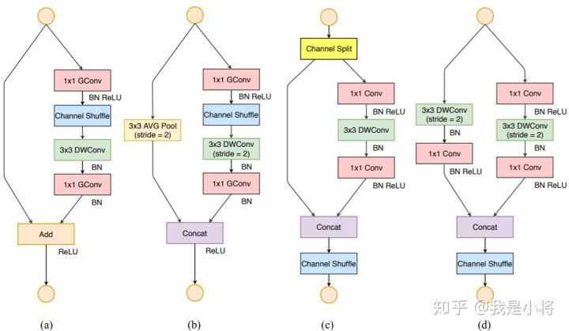
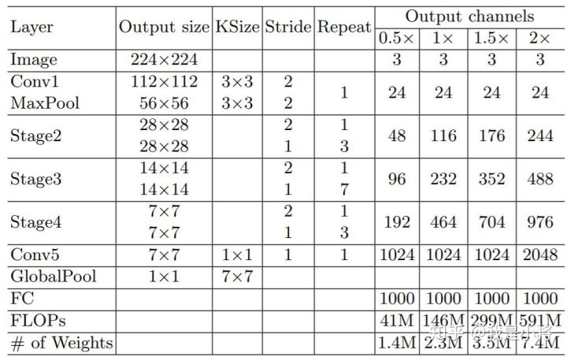
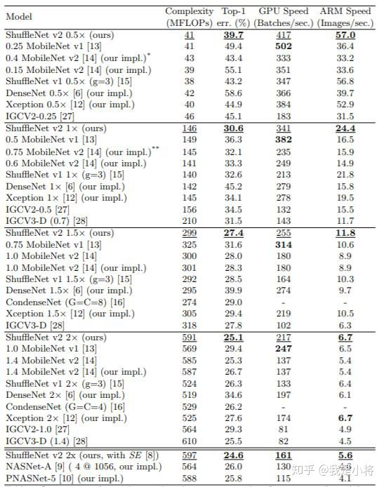

# ShuffleNetV2

> 原文链接：https://zhuanlan.zhihu.com/p/48261931

近来，深度CNN网络如ResNet和DenseNet，已经极大地提高了图像分类的准确度。但是除了准确度外，计算复杂度也是CNN网络要考虑的重要指标，过复杂的网络可能速度很慢，一些特定场景如无人车领域需要低延迟。另外移动端设备也需要既准确又快的小模型。为了满足这些需求，一些轻量级的CNN网络如MobileNet和ShuffleNet被提出，它们在速度和准确度之间做了很好地平衡。今天我们要讲的是ShuffleNetv2，它是旷视最近提出的ShuffleNet升级版本，并被ECCV2018收录。在同等复杂度下，ShuffleNetv2比ShuffleNet和MobileNetv2更准确。

图1：ShuffleNetv2与其它算法在不同平台下的复杂度、速度以及准确度对比

## 设计理念

目前衡量模型复杂度的一个通用指标是FLOPs，具体指的是multiply-add数量，但是这却是一个间接指标，因为它不完全等同于速度。如图1中的（c）和（d），可以看到相同FLOPs的两个模型，其速度却存在差异。这种不一致主要归结为两个原因，首先影响速度的不仅仅是FLOPs，如内存使用量（memory access cost, MAC），这不能忽略，对于GPUs来说可能会是瓶颈。另外模型的并行程度也影响速度，并行度高的模型速度相对更快。另外一个原因，模型在不同平台上的运行速度是有差异的，如GPU和ARM，而且采用不同的库也会有影响。

图2：不同模型的运行时间分解

据此，作者在特定的平台下研究ShuffleNetv1和MobileNetv2的运行时间，并结合理论与实验得到了4条实用的指导原则：

**（G1）同等通道大小最小化内存访问量** 对于轻量级CNN网络，常采用深度可分割卷积（depthwise separable convolutions），其中点卷积（ pointwise convolution）即1x1卷积复杂度最大。这里假定输入和输出特征的通道数分别为 $c_1$ 和$c_2$ ，特征图的空间大小为 $h \times w$，那么1x1卷积的FLOPs为$ B=hwc_1c_2 $。对应的MAC为 $ hw(c_1+c_2)$（这里假定内存足够），根据均值不等式，固定 $B$ 时，MAC存在下限

仅当 $c_1=c_2 $ 时，MAC取最小值，这个理论分析也通过实验得到证实，如表1所示，通道比为1:1时速度更快。

表1：G1的实验验证

**（G2）过量使用组卷积会增加MAC** 组卷积（group convolution）是常用的设计组件，因为它可以减少复杂度却不损失模型容量。但是这里发现，分组过多会增加MAC。当 ![[公式]](https://www.zhihu.com/equation?tex=g) 增加时，MAC会同时增加。这点也通过实验证实，所以明智之举是不要使用太大 ![[公式]](https://www.zhihu.com/equation?tex=g) 的组卷积。

**（G3）网络碎片化会降低并行度** 一些网络如Inception，以及Auto ML自动产生的网络NASNET-A，它们倾向于采用“多路”结构，即存在一个lock中很多不同的小卷积或者pooling，这很容易造成网络碎片化，减低模型的并行度，相应速度会慢，这也可以通过实验得到证明。

**（G4）不能忽略元素级操作** 对于元素级（element-wise operators）比如ReLU和Add，虽然它们的FLOPs较小，但是却需要较大的MAC。这里实验发现如果将ResNet中残差单元中的ReLU和shortcut移除的话，速度有20%的提升。

上面4条指导准则总结如下：

- 1x1卷积进行平衡输入和输出的通道大小；
- 组卷积要谨慎使用，注意分组数；
- 避免网络的碎片化；
- 减少元素级运算。

## 网络结构

根据前面的4条准则，作者分析了ShuffleNetv1设计的不足，并在此基础上改进得到了ShuffleNetv2，两者模块上的对比如图3所示：

图3：ShuffleNet两个版本结构上的对比

在ShuffleNetv1的模块中，大量使用了1x1组卷积，这违背了**G2**原则，另外v1采用了类似ResNet中的瓶颈层（bottleneck layer），输入和输出通道数不同，这违背了**G1**原则。同时使用过多的组，也违背了**G3**原则。短路连接中存在大量的元素级Add运算，这违背了**G4**原则。

为了改善v1的缺陷，v2版本引入了一种新的运算：channel split。具体来说，在开始时先将输入特征图在通道维度分成两个分支：通道数分别为$c^{'}$和 $c-c^{'}$ ，实际实现时$c^{'}=c/2$ 。左边分支做同等映射，右边的分支包含3个连续的卷积，并且输入和输出通道相同，这符合**G1**。而且两个1x1卷积不再是组卷积，这符合**G2**，另外两个分支相当于已经分成两组。两个分支的输出不再是Add元素，而是concat在一起，紧接着是对两个分支concat结果进行channle shuffle，以保证两个分支信息交流。其实concat和channel shuffle可以和下一个模块单元的channel split合成一个元素级运算，这符合原则**G4**。

对于下采样模块，不再有channel split，而是每个分支都是直接copy一份输入，每个分支都有stride=2的下采样，最后concat在一起后，特征图空间大小减半，但是通道数翻倍。

为此，ShuffleNetV2做出了改进，如图( c )所示，在每个单元的开始，c特征通道的输入被分为两个分支（在ShuffleNetV2中这里是对channels均分成两半）。根据G3，不能使用太多的分支，所以其中一个分支不作改变，另外的一个分支由三个卷积组成，它们具有相同的输入和输出通道以满足G1。两个1 × 1卷积不再是组卷积，而改变为普通的1x1卷积操作，这是为了遵循G2（需要考虑组的代价）。卷积后，两个分支被连接起来，而不是相加(G4)。因此，通道的数量保持不变(G1)。然后使用与ShuffleNetV1中相同的“channels shuffle”操作来启用两个分支之间的信息通信。需要注意，ShuffleNet v1中的“Add”操作不再存在。像ReLU和depthwise convolutions 这样的元素操作只存在于一个分支中。

对于空间下采样，单元稍作修改，移除通道分离操作符。因此，输出通道的数量增加了一倍。具体结构见图（d）。所提出的构建块( c )( d )以及由此产生的网络称为ShuffleNet V2。基于上述分析，我们得出结论，该体系结构设计是高效的，因为它遵循了所有的指导原则。积木重复堆叠，构建整个网络

ShuffleNetv2的整体结构如表2所示，基本与v1类似，其中设定每个block的channel数，如0.5x，1x，可以调整模型的复杂度。

表2：ShuffleNetv2的整体结构

值得注意的一点是，v2在全局pooling之前增加了个conv5卷积，这是与v1的一个区别。最终的模型在ImageNet上的分类效果如表3所示：

表3： ShuffleNetv2在ImageNet上分类效果

可以看到，在同等条件下，ShuffleNetv2相比其他模型速度稍快，而且准确度也稍好一点。同时作者还设计了大的ShuffleNetv2网络，相比ResNet结构，其效果照样具有竞争力。

从一定程度上说，ShuffleNetv2借鉴了DenseNet网络，把shortcut结构从Add换成了Concat，这实现了特征重用。但是不同于DenseNet，v2并不是密集地concat，而且concat之后有channel shuffle以混合特征，这或许是v2即快又好的一个重要原因。