# 轻量级网络-Mobilenet系列(v1,v2,v3)

> 原文链接：https://zhuanlan.zhihu.com/p/394975928

本文主要介绍mobilenet系列：mobilenetV1、mobilenetV2、mobilenetV3三个特征提取网络。MobileNet模型是Google针对手机等嵌入式设备提出的一种轻量级的深层神经网络，其使用的**核心思想**便是**depthwise separable convolution（深度可分离卷积）**。

**（1）什么是深度可分离卷积(Mobilenetv1提出)？**

假设某一网络卷积层，其卷积核大小为3×3，输入通道为16，输出通道为32；

常规卷积操作是将32个3×3×16的卷积核作用于16通道的输入图像，则根据卷积层参数量计算公式，[卷积计算+卷积参数量+卷积计量量](https://zhuanlan.zhihu.com/p/395354063)

得到所需参数为32*(3*3*16+1)= 4640个。

若先用16个、大小为3×3的卷积核(3*3*1)作用于16个通道的输入图像，得到了16个特征图，在做融合操作之前，接着用32个大小为1×1的卷积核(1*1*16)遍历上述得到的16个特征图，根据卷积层参数计算公式，所需参数为(3*3*1*16+16) + (1*1*16*32+32) = 706个。

上述即为深度可分离卷积的作用，通俗的讲，普通卷积层的特征提取与特征组合一次完成并输出，而深度可分离卷积先用厚度为1的3*3的卷积核（**depthwise分层卷积**），再用1*1的卷积核(**pointwise 卷积**)调整通道数，将特征提取与特征组合分开进行。

由此可以看出，深度可分离卷积可大大减少模型的参数，其具体结构如下图：

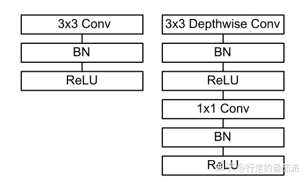

左边为普通卷积层结构，右边为深度可分离卷积结构

- 在进行 **deepthwise(DW)** 卷积时只使用了`一种`维度为`in_channels`的卷积核进行**特征提取**（没有进行特征组合）；
- 在进行 **pointwise(PW)** 卷积时只使用了`output_channels 种` 维度为`in_channels` 1*1 的卷积核进行**特征组合。**

**(2）什么是Bottleneck layer(Resnet block提出)？**

Bottleneck layer又称之为瓶颈层，使用的是1*1的卷积神经网络。使用![[公式]](images/times+1.svg+xml)的网络结构，其目的是把高维特征映射到低维空间去。另外说一句，使用![[公式]](https://www.zhihu.com/equation?tex=1%5Ctimes+1)的网络结构将高维空间映射到低纬空间的设计有的时候我们也称之为**Projection layer**（Mobilenetv2使用**）。**

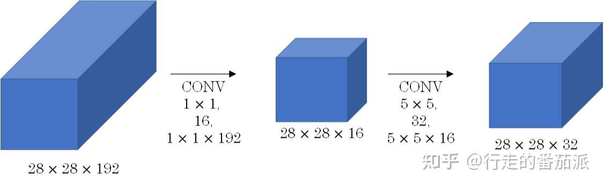

Bottleneck layer这种结构比较常见的出现地方就是ResNet block了，如下图。

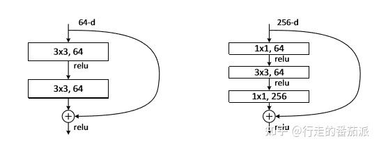

没有bottleneck的ResNet residual block模块 有bottleneck的ResNetresidual block模块

**(3)什么是bottleneck residual block（ResNet论文中的）？**

bottleneck residual block的结构形状是中间窄两头胖，目的是加深网络、减少计算和参数量。

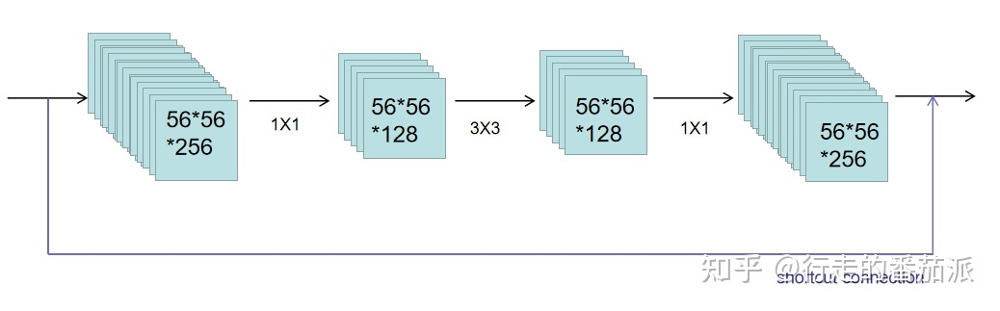residual block 形状

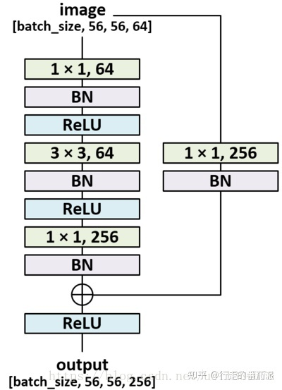

residual block 网络结构

**(3）什么是 Expansion layer(Mobilenetv2提出)？**

**Expansion layer**的功能与**Bottleneck layer**正相反，使用![[公式]](https://www.zhihu.com/equation?tex=1%5Ctimes+1)的网络结构，目的是将低维空间映射到高维空间。这里Expansion有一个超参数是维度扩展几倍。可以根据实际情况来做调整的，默认值是6，也就是扩展6倍。

**(4）什么是 Inverted Residuals结构(Mobilenetv2提出)？**

在MobileNetV2中的Inverted Residuals正好与ResNet的bottleneck residual block相反，其结构形状是中间胖两头窄。

即：1、在可分离卷积的前面增加一个大小为1*1的卷积进行升维（Expansion layer）；2、将输入和输出的部分进行连接（residual connection）, 如下图所示。

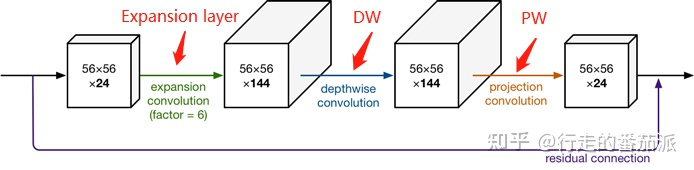

Inverted Residuals（中间大两头小)

**(5) 什么是Linear Bottlenck结构(Mobilenetv2提出)？**

由于DW、PW都是以Relu作为激活函数，且**PW会做降维**，**再对低维特征做ReLU时会丢失很多信息，**所以从高维向低维转换，使用ReLU激活函数可能会造成信息丢失或破坏（所以不使用非线性激活数函数），即在PW这一部分，我们不再使用ReLU激活函数而是使用线性激活函数，如下图。

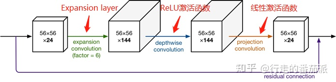

**【一、MobilenetV1】**

论文地址：[1704.04861.pdf (arxiv.org)](https://link.zhihu.com/?target=https%3A//arxiv.org/pdf/1704.04861.pdf)

- 引入了深度可分离卷积
- 直筒结构（网络结构）

MobileNetV1网络主要思路就是深度可分离卷积的堆叠。

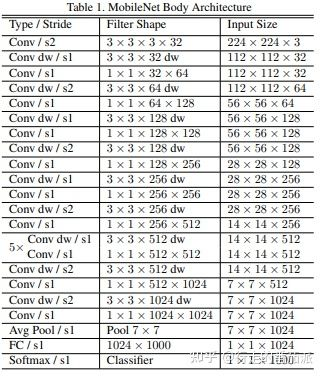

Mobilenetv1网络结构

**【二、MobilenetV2】**

论文地址：[[1801.04381\] MobileNetV2: Inverted Residuals and Linear Bottlenecks (arxiv.org)](https://link.zhihu.com/?target=https%3A//arxiv.org/abs/1801.04381)

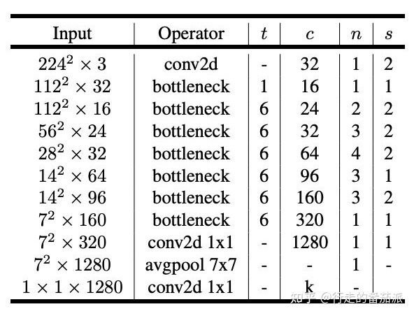

Mobilenetv2网络结构

上图中，MobilenetV2 unit包含stride=1和stride=2两种。

- 引入了bottleneck结构。
- 将bottleneck结构变成了纺锤型，即resnet是先缩小为原来的1/4，再放大，他是放大到原来的6倍，再缩小。
- 并且去掉了Residual Block最后的ReLU

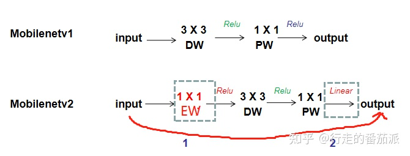

MobilenetV2的主要改进是Linear Bottleneck 和 Inverted Residuals. 在MobilenetV2的网络设计中，作者除了继续使用深度可分离卷积结构之外，还使用了Expansion layer和 Projection layer。

**为什么这么做？**我们知道，如果tensor维度越低，卷积层的乘法计算量就越小。那么如果整个网络都是低维的tensor，那么整体计算速度就会很快。然而，如果只是使用低维的tensor效果并不会好。如果卷积层的过滤器都是使用低维的tensor来提取特征的话，那么就没有办法提取到整体的足够多的信息。所以，如果提取特征数据的话，我们可能更希望有高维的tensor来做这个事情，V2就设计这样一个结构来达到平衡。先通过Expansion layer来扩展维度，之后在用深度可分离卷积来提取特征，之后使用Projection layer来压缩数据，让网络从新变小。因为Expansion layer 和 Projection layer都是有可以学习的参数，所以整个网络结构可以学习到如何更好的扩展数据和从新压缩数据。

**【三、MobilenetV3】**

论文地址：[https://arxiv.org/abs/1905.02244](https://link.zhihu.com/?target=https%3A//arxiv.org/abs/1905.02244)

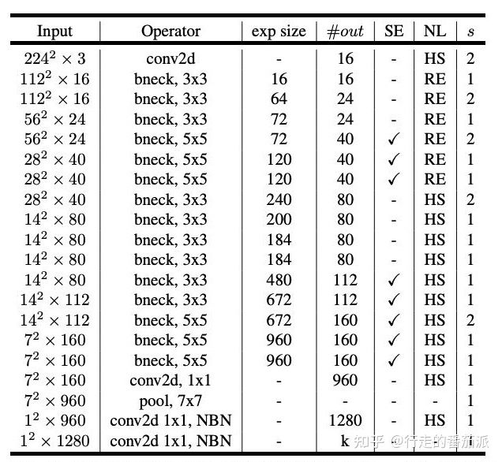

Mobilenetv3网络结构

上图中，MobilenetV3 unit包含stride=1和stride=2两种。

- 引入SE结构
- 修改网络尾部结构
- 修改channel数量
- 非线性变换的改变

在bottlenet结构中加入了SE结构，并且放在了depthwise filter之后，如下图。因为SE结构会消耗一定的时间，所以作者在含有SE的结构中，将expansion layer的channel变为原来的1/4,这样作者发现，即提高了精度，同时还没有增加时间消耗。并且SE结构放在了depthwise之后。

在mobilenetv2中，在avg pooling之前，存在一个1x1的卷积层，目的是提高特征图的维度，更有利于结构的预测，但是这其实带来了一定的计算量了，所以这里作者修改了，将其放在avg pooling的后面，首先利用avg pooling将特征图大小由7x7降到了1x1，降到1x1后，然后再利用1x1提高维度，这样就减少了7x7=49倍的计算量。并且为了进一步的降低计算量，作者直接去掉了前面纺锤型卷积的3x3以及1x1卷积，进一步减少了计算量，就变成了如下图第二行所示的结构，作者将其中的3x3以及1x1去掉后，精度并没有得到损失。这里降低了大约15ms的速度。

修改头部卷积核channel数量，mobilenet v2中使用的是32 x 3 x 3，作者发现，其实32可以再降低一点，所以这里作者改成了16，在保证了精度的前提下，降低了3ms的速度。

使用h-swish替换swish，由于sigmoid的计算耗时较长，特别是在移动端，这些耗时就会比较明显，所以作者使用ReLU6(x+3)/6来近似替代sigmoid。**利用ReLU有几点好处，1.可以在任何软硬件平台进行计算，2.量化的时候，它消除了潜在的精度损失，使用h-swish替换swith，在量化模式下回提高大约15%的效率，另外，h-swish在深层网络中更加明显。**

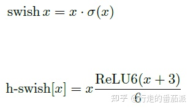