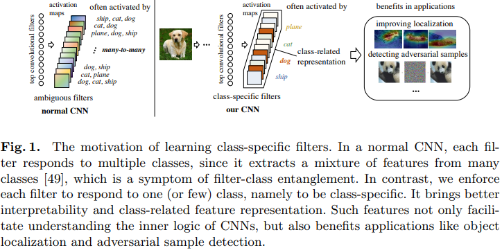
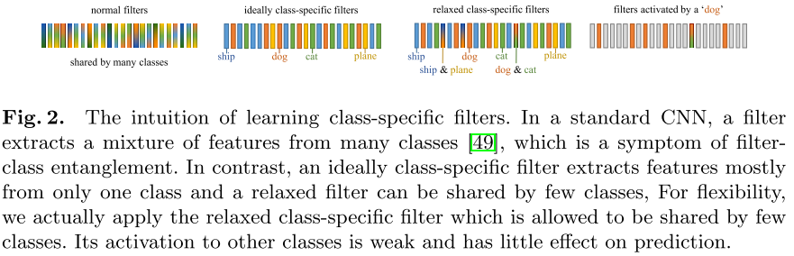
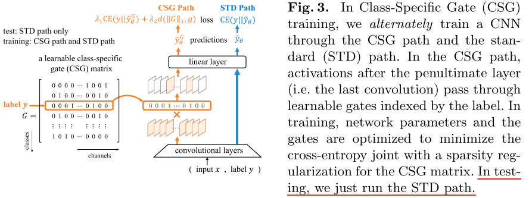
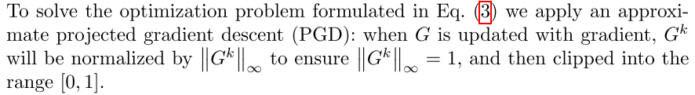
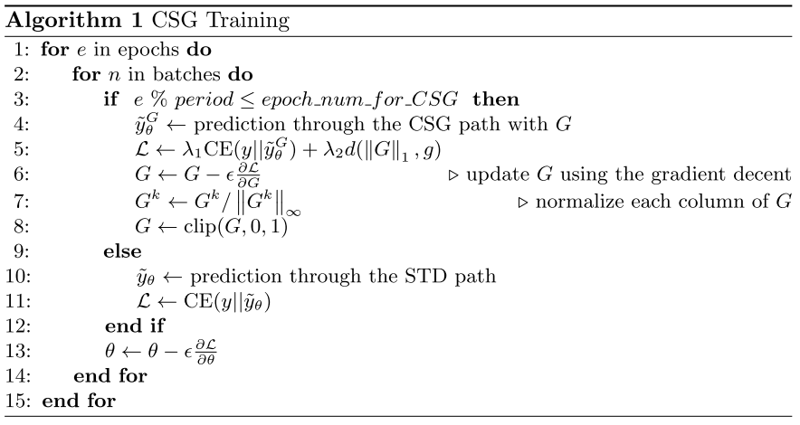

# Training Interpretable Convolutional Neural Networks by Differentiating Class-specific Filters

## 摘要

cnn通常被视为 “黑匣子”，缺乏可解释性。一个主要原因是由于卷积核和类之间错综复杂的多对多对应关系。大多数现有作品都尝试对预先训练的模型进行事后解释，而忽略了减少模型背后的纠缠。相反，**我们专注于减轻训练过程中的卷积核类纠缠**。

我们提出了一种新颖的策略，通过鼓励特定于类的卷积核来训练可解释的cnn，其中每个卷积核仅响应一个 (或几个) 类。

具体而言，我们设计了一种可学习的稀疏类特定门 (Class-Specific Gate，CSG) 结构，以灵活的方式为每个滤波器分配一个 (或几个) 类。仅当输入样本来自特定类时，该门才允许卷积核的激活通过。

## 引言

在本文中，我们认为 filter-class entanglement 是阻碍CNNs可解释性的最关键的原因之一。 过滤器和类之间复杂的多对多对应关系是所谓的过滤器类纠缠，如图1所示。 

为了缓解这种纠缠，**本文的目标是学习只响应一个（或几个）类的类特定滤波器。** 

### 前人的研究

许多已有的研究表明，通常情况下，纠缠的处理并不是一件简单的事情。 

（1）大多数与可解释性相关的研究仅仅集中在过滤器的事后解释[2,40]，它设法解释过滤器捕获的主要语义概念。 然而，post-hoc解释不能缓解预训练模型中普遍存在的滤波器类纠缠。 

（2）许多Vaes的变体[18,6,20,9,25]和Infogan[10]试图以无监督的方式学习具有更好解释性的解纠缠数据表示。 然而，[26]对它们提出了挑战，证明了在没有适当的归纳偏差的情况下，不可能无监督地学习分离的特征。 

尽管存在上述挑战，但**在图像分类任务中，在高卷积层学习类特定滤波器是合理可行的**。 

（1）已经证明，高层卷积过滤器提取可能在某种程度上与某些类别相关的高级语义特征[44]；  

（2）不同过滤器提取的特征之间的冗余重叠使得学习专门的过滤器成为可能[33]； 

 (3) 专用过滤器在计算机视觉任务中表现出更高的可解释性 [49] 和更好的性能 [33]； 

 (4) [19,42,29] 在不灵活的预定义滤波器类对应关系下，成功地在高卷积层中学习了特定于类的滤波器。

### 我们的想法

因此，我们建议在训练期间在最后一个卷积层中学习特定于类的过滤器，这是受到细胞分化 [37] 的启发。 

通过分化，干细胞进化为具有特化本能的功能细胞，从而有效地支持多细胞生物的复杂功能。 例如，通过来自传输放大细胞的特定模拟，神经干细胞将分化为不同的类别，如神经元、星形胶质细胞和少突胶质细胞。 同样，我们希望 CNN 中的过滤器能够“区分”对特定任务负有专门责任的不同群体。 具体来说，**我们鼓励 CNN 在训练期间建立一个过滤器到一个类的对应关系**（微分）。

### 创新点

具体来说，我们**提出了一种新的训练方法**来学习特定类别的过滤器。 与预先定义过滤器类对应关系的特定类过滤器的现有工作不同，**我们的模型学习了一种灵活的对应关系，它只将过滤器的必要部分分配给一个类，并允许类共享过滤器**。

 具体来说，我们在最后一个卷积过滤器之后设计了一个可学习的类特定门（CSG）结构，它将过滤器分配给类，并限制每个过滤器的激活仅在输入其特定类时通过。 

在我们的训练过程中，我们**定期**将 CSG 插入到 CNN 中，并共同最小化分类交叉熵和 CSG 的稀疏性，以保持模型在分类上的性能，同时鼓励特定类别的过滤器。 第 4 节的实验结果表明，我们的训练方法使数据表示稀疏且与标记类高度相关，这不仅说明了滤波器类纠缠的减轻，而且从滤波器正交性和滤波器冗余等多个方面增强了可解释性。 此外，在第 5 节中，我们的方法在改进对象定位和对抗样本检测等应用中显示出优势。

### 贡献

（1）我们提出了一种新的 CNN 训练策略来学习灵活的类过滤器对应关系，其中每个过滤器主要从一个或几个类中提取特征；

  (2) 我们建议利用滤波器激活和类预测之间的互信息来评估滤波器类对应关系，此外，我们设计了一个基于它的度量来评估网络层中的整体滤波器类纠缠；

  (3) 我们定量地证明了特定类过滤器在减轻过滤器冗余、增强可解释性以及对象定位和对抗样本检测等应用方面的好处。

## 相关工作

与我们的工作相关的现有工作包括事后过滤器解释、学习解耦表示。

**过滤器的事后解释**被广泛研究，旨在解释过滤器在预训练的 CNN 中捕获的模式。 大量的工作将神经元的模式可视化为图像，这是关于神经元激活的某个分数的梯度 [44,28,36] 或累积梯度 [30,32]。 一些工作通过将卷积滤波器视为模式检测器 [2] 或附加辅助检测模块 [14] 来确定卷积滤波器提取的主要视觉模式。 其他一些工作将 CNN 中的表示转换为解释图 [47,46] 或决策树 [50,1]，旨在找出过滤器的视觉模式和共同激活模式之间的关系。

 事后过滤器解释有助于理解过滤器的主要模式，但不会改变预训练模型的现有过滤器类纠缠，而我们的工作旨在训练可解释模型。

**学习解耦表示**是指学习将不同语义信息编码成不同维度的数据表示。 作为一项原则，事实证明，如果没有归纳偏差 [26]，就不可能学习解耦表示。  VAE [22] 和 InfoGAN [10] 的变体等无监督方法依赖于正则化。  VAE [22] 被修改为许多变体 [18,6,20,9,25]，而它们的解开性能对超参数和随机种子很敏感。 其他一些无监督方法依赖于特殊的网络架构，包括可解释的 CNNs [49] 和 CapsNet [35]。 至于有监督的方法，[41] 建议解开与环境的交互；  [4] 应用来自分组信息的弱监督，而我们的工作应用来自分类标签的弱监督。

**特定类别的过滤器**已应用于图像和视频分类任务。 现有的工作重点是提高准确性，包括标签一致的神经元 [19] 和滤波器组 [42,29]。 然而，**这些工作预先定义了过滤器和类之间的不可学习的对应关系**，其中主要每个过滤器仅响应一个类，并且所有类占用相同数量的过滤器。 相比之下，本文侧重于类特定过滤器的可解释性，**我们提出了一种更灵活的对应关系，其中相似的类可以共享过滤器，一个类可以占用可学习数量的过滤器**。 因此，我们的可学习对应关系有助于揭示类间相似性和类内可变性。

## 方法

在 CNN 中学习分离的过滤器可以减轻过滤器类的纠缠，同时缩小人类概念与 CNN 表示之间的差距。 在本节中，我们首先介绍一个理想的类特定过滤器案例，这是我们解缠结训练的一个方向，然后我们详细说明了如何在训练可解释网络时诱导过滤器分化的方法。

### 理想的特定类过滤器

本小节介绍了我们的过滤器解纠缠训练目标的理想案例。如图2所示，每个滤波器主要仅响应 (即涉及) 一个类。我们将此类过滤器称为理想的特定于类的过滤器，并将训练中的解缠结过滤器称为特定于类的过滤器分配。

为了给出卷积层的“理想特定类”的严格定义，我们使用矩阵$ G\in \left [ {0,1} \right ]^{C\times K} $ 以测量过滤器和类之间的相关性，其中K是过滤器的数量，C是类的数量。矩阵中的每个元素代表卷积核和类别的相关性，值越大，相关性越大。

如图3.2所示，如果 $G^{k}_{c}=1$，则第 $k$ 个滤波器主要提取第 $c$ 类的特征

给定 $(x，y)$ 作为输入，我们可以从矩阵G中索引行 $G_{y}$，它可以用作乘以激活映射的门来关闭那些不相关的通道。

$\widetilde{y}$ 是标准路径预测的概率向量，$\widetilde{y}^{G}$ 是调整后的概率向量

### 问题表述

为了训练CNN将滤波器区分到特定的类，同时保持分类精度，我们除了引入正向传播的标准(STD)路径外，还引入了特定类的门(CSG)路径。在CSG路径中，通道被可学习的门选择性地阻塞。该路径的分类性能被认为是滤波器微分训练的**一种正则化**方法。

为了找到精确描述过滤器和类之间相关性的门矩阵 G，我们在二维空间中搜索通过 CSG 路径产生最佳分类性能的 G，即解决优化问题 $\Phi_{0}(\theta)=\min \mathrm{CE}\left(y \| \tilde{y}_{\theta}^{G}\right)$ s.t. $\forall k \in\{1,2, \ldots, K\}$，其中 G 的每一行都是独热编码。把这个作为 CE Loss 的正则项加到原始的 CE Loss 损失函数里，新的损失函数形式如下：

$$
L_{0}(\theta)=CE(y \| \tilde{y}_{\theta})+\lambda_{1}\Phi_{0}(\theta)
$$

然而，最初的问题在实践中很难解决。 一方面，每个过滤器是完整的单过滤器/一类假设的假设几乎不成立，因为在 CNN 中通常多个类共享一个高级特征； 另一方面，非连续空间中的二元向量很难用梯度下降进行优化。

**放松限制**

让矩阵 G 不是只能从 0 和 1 两个值中选择，让其松弛为一个稀疏的连续向量。其中 $G^{k}$ （第 k 列）至少有一个元素是1，也就是说 $G^{k}$ 的无穷范数为1（就是说，一个卷积核最少关联一个类）。也就是说，关联矩阵 G 的 L1 范数的下界是卷积核个数 K

> 无穷范数——向量中最大元素的绝对值
>
> L1范数——向量中元素的绝对值之和

为了达到这一目的，我们引入另外一个正则项 $d(\| G \|_{1}, g)$ ，这个正则项让 G 的 L1范数不超过上界 $g$，小于上界的时候，啥都不干。通用形式就是 $d(a, b)=\psi(RELU(a-b))$，$\psi$ 可以是任意范数。除此之外，上界 $g \geq K$ 

则正则项修改为

$$
\Phi(\theta)=\min _{G}\left\{\mathrm{CE}\left(y \| \tilde{y}_{\theta}^{G}\right)+\mu d\left(\|G\|_{1}, g\right)\right\} \quad \text { s.t. } G \in V_{G}
$$

其中 $V_{G}$ 是上文提到的限制条件，$\mu$ 是平衡系数

最终的损失函数如下：

$$
\min _{\theta, G} L(\theta, G)=\mathrm{CE}\left(y \| \tilde{y}_{\theta}\right)+\lambda_{1} \mathrm{CE}\left(y \| \tilde{y}_{\theta}^{G}\right)+\lambda_{2} d\left(\|G\|_{1}, g\right) \quad \text { s.t. } G \in V_{G} .
$$

### 优化

然而，由于收敛性差，对于正常的训练方案来说可能是困难的。 在正常方案中，我们通过 CSG 和 STD 路径进行预测，以直接计算 L(θ, G) 并用它的梯度更新 θ 和 G。 由于大多数通道在 CSG 路径中被阻塞，通过 CSG 路径的梯度将比 STD 路径的梯度弱得多，这阻碍了收敛到特定类别的滤波器。

为了解决这个问题，我们提出了一种替代训练方案，即 STD/CSG 路径在不同的时期交替工作。

在该方案中，分类性能在开始时呈周期性波动，但收敛性能略好于我们测试中的正常方案。 同时，过滤器逐渐分化为特定类别的过滤器。

## 实验

特定于一个类的过滤器对于识别这个类是必不可少的

CSG给我们的启示是，具有跨类特征的硬样本往往会被错误分类。因此，CSG CNN中错误分类的机制可能是通过共享过滤器提取跨类别的特征。这在一定程度上证明了差分对精度是有益的。

类间过滤器近似正交且冗余较少，并且类特定过滤器产生高度类相关的表示。

基于过滤器相关性，我们进一步发现用 CSG 训练的过滤器产生高度与类相关的表示，即图像的表示往往与其标记的类而不是其他类完全对应。 因为隐含的类主要决定了哪些过滤器被激活最多，同时这些过滤器被其他类激活较少，与其他类的过滤器相关性较小。

