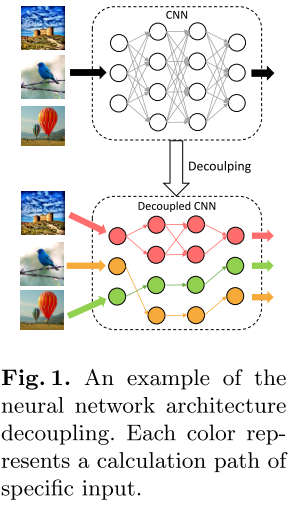
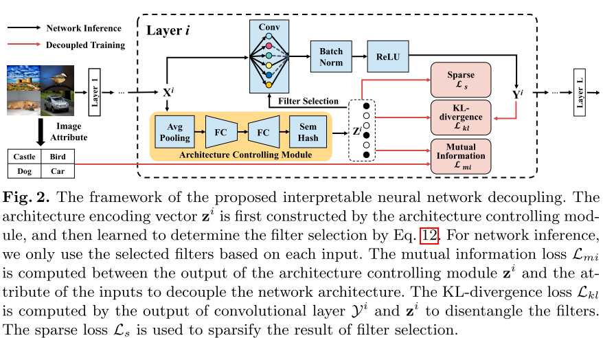
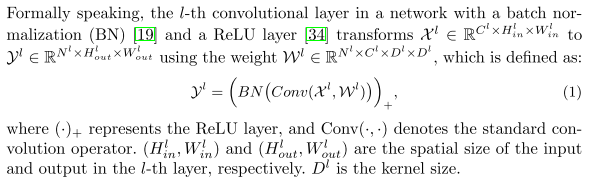
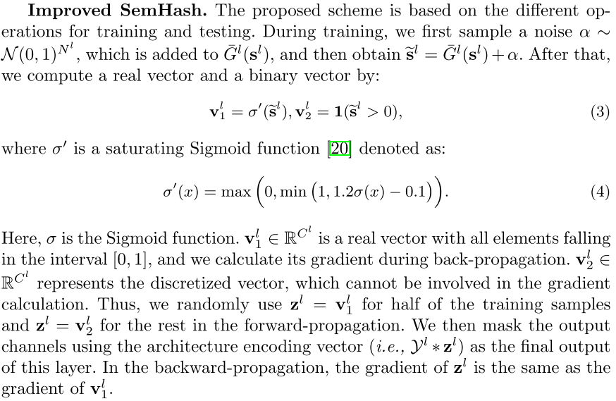
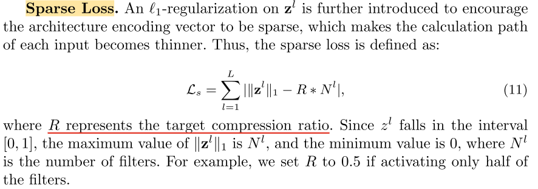
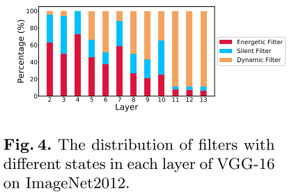

# Interpretable Neural Network Decoupling

论文：https://arxiv.org/abs/1906.01166

## 摘要

对于网络解释，以往的研究主要采用单过滤器分析，而忽略了过滤器之间的关系。**在本文中，我们提出了一种新的架构解耦方法，从研究其计算路径的角度来解释网络。**更具体地说，我们在每一层中引入了一个新的架构控制模块，通过向量对网络架构进行编码。通过最大化矢量和输入图像之间的互信息，该模块被训练以选择特定的滤波器来为每个输入提取唯一的计算路径。此外，为了提高解耦网络的可解释性和紧致性，对每一层的输出进行编码，以在稀疏性正则化的约束下对结构编码向量进行对齐。与传统的像素级或滤波器级网络解释方法不同，我们提出了路径级分析来探索滤波器和语义概念之间的组合关系，这更适合于解释解耦网络的工作原理。

## 引言

为此，探索了网络解释，以提高对神经网络的内在结构和工作机制的理解 [45、2、444、46、22、30、5]。解释神经网络涉及调查决策过程背后的原理及其参数的作用。例如，某些方法 [24,5] 在解释其工作过程时将网络视为一个整体。但是，这些方法过于粗粒度，无法探索网络中的固有属性。相反，网络可视化方法 [45,44] 通过分析像素级特征表示来解释每个参数的作用，这总是需要复杂的反复试验。Beyonds，Bau等人 [2] 和Zhang等人 [46] 探讨了过滤器在网络决策过程中的不同作用。尽管这些方法更适合解释网络，但它们仅使用单个过滤器来表征语义概念，这已被证明比使用多个过滤器的组合更有效 [39,11]。在这种情况下，可以将不同的滤波器组合视为网络中不同的计算路径，这激发了我们基于路径级分析来研究网络的工作过程。然而，**挑战来自这样一个事实，即每个推理都涉及网络中的所有过滤器，并且具有相同的计算过程，这使得解释每个计算路径如何影响最终结果变得很难**。为了克服这个问题，以前的方法 [41,42] 通过减少计算过程中涉及的参数数量来探索不同输入的计算路径之间的差异。例如，Wang等人 [41] 提出了一种事后分析，以基于预先训练的模型获得特定输入的唯一计算路径，但是该模型涉及大量复杂的实验。此外，Sun等人 [42] 通过修改SGD算法学习了在最后一层生成动态计算路径的网络。但是，它忽略了以下事实：过滤器的响应在中间层中也是动态的，因此无法解释整个网络的工作方式。

本文提出了一种可解释的网络解耦方法，使网络能够自适应地选择合适的滤波器子集以形成每个输入的计算路径，如图1所示：

具体来说，**我们的设计原理在于一个新颖的轻量级结构控制模块以及一个新颖的网络解耦学习过程**。

图2描绘了所提出的方法的框架。

首先**将体系结构控制模块并入每一层**，以便在网络推理期间以可忽略的计算负担动态地选择过滤器。

然后，在训练过程中，我们将架构编码向量(即架构控制模块的输出)与输入图像的固有属性之间的**互信息最大化**，这允许网络动态地生成与输入相关的计算路径。

此外，为了进一步提高解耦网络的可解释性，通过减小卷积层之间的KL散度，增加每个卷积层的结构编码向量与输出向量之间的相似度，**使得滤波器只响应特定对象**。

最后，**对结构编码向量进行稀疏化处理**，对计算路径进行衰减，消除了每个输入的冗余滤波器。

本文还**提出了一种改进的语义散列方案**，使离散结构的编码向量可区分，从而可以直接用随机梯度下降 (SGD) 训练。

相应地，解耦网络变得更易于解释，并且可以逐层跟踪功能处理行为，以形成了解解耦网络工作原理的分层路径。同时，每个滤波器在解耦后仅与一组相似的输入图像相关，因此它们也变得更具解释性，并且它们的组合形成了解耦的子体系结构，从而更好地表征了特定的语义概念。这种解耦的体系结构进一步受益于网络加速的低计算成本，以及对抗性样本检测的良好提示，这些提示随后在我们的实验中得到验证。

我们将我们的三个主要贡献总结如下：

- 通过动态选择不同输入的滤波器来解释神经网络，我们提出了一个轻量级架构控制模块，该模块是可变的，并且可以根据我们提出的损失通过SGD进行优化。

- 解耦网络**保留了与原始网络相似的性能，并且具有更好的可解释性**。因此，它能够很好地解释每个计算路径的功能处理，这有助于更好地理解网络推理背后的基本原理，以及探索解耦网络中过滤器和语义概念之间的关系。

- 我们的方法是通用和灵活的，可以很容易地在现有的网络架构上使用，如VGGNets[37]，ResNets[14]和Inceptions[38]。解耦架构进一步有利于广泛的应用，包括网络加速和对抗性样本检测。

## 相关工作

### 解释网络

解释网络的一种方法是分析它如何响应特定输入图像以进行输出预测 [22,30,24,47,5]。 该策略将网络视为一个整体，通过探索神经网络的知识盲点 [24] 或通过为每个输出特征分配一个特定预测的重要性值来解释网络预测结果 [30]。 此外，决策树 [47] 或解释器网络 [5] 已被用于更好地理解分类过程。 然而，这些方法只关注网络预测结果背后的原因，而忽略了每个参数的作用，难以理解它们对网络的影响。

为了打开神经网络的黑箱并解释参数的作用，已经提出了几种方法[45，44，8]来可视化网络内部的特征表示。例如，Zeiler等人[45]通过建立对应于原始网络的去卷积网络，可视化中间层中的特征图。Yoshinski等[44]提出了两种可视化方法来探索特征中包含的信息：对预先训练的模型进行相应的事后分析和通过正则化优化学习网络。可视化特征表示是解释参数在网络中的作用的一种非常直接的方法，但由于参数数量巨大，这需要大量的实验。

除了上述方法外，还探索了过滤器的功能以解释网络 [43,2,33,46,42]。 他们评估了过滤器的可迁移性 [43] 或量化了过滤器和类别之间的关系 [33] 以解释它们的不同作用。 与使用单个过滤器来表示语义概念相比，[39,11] 中的方法发现通过组合多个过滤器可以更好地表征语义概念。 王等人。  [39] 进一步验证了对多个过滤器的激活进行聚类可以比使用单个过滤器更好地表示语义概念。 方等人。  [11] 基于多个过滤器的响应将语义概念映射到矢量嵌入中，发现这些嵌入可以更好地表征特征。 与这些方法不同的是，我们通过解耦网络来解释基于路径级别分析的网络工作原理，在此基础上，我们进一步解开每个层内过滤器，以探索计算路径上过滤器之间的可解释语义概念。 我们的方法比这些工作更符合网络的内部工作机制，并且对其他应用有更好的扩展，例如网络加速和对抗样本检测。

### 条件计算

条件计算的工作在生成计算路径时往往集中在模型组件的选择上。例如，[3] 中的工作探索了在估计损失函数的梯度时随机或非平滑神经元的影响。后来，通过强化学习[4]或SGD[6]学习了一个专家网络，为每个输入找到合适的计算路径。然而，特定专家网络的要求使这些方法变得繁琐。沿着另一条线，停止分数 [9] 或可区分的有向无环图 [28] 已被用于动态调整计算过程中涉及的模型组件。最近，引入了一种特征增强和抑制方法 [12]，以在运行时跳过卷积层的不重要输出通道。但是，它为每一层选择相同数量的过滤器，而不考虑层间差异。与上述工作不同，我们采用了一种新颖的架构控制模块，通过使其适应数据分布来解耦网络。解耦后，网络变得可解释，使我们能够可视化其内在结构，加速推理并检测对抗样本。

## 架构解耦

### 架构控制模块

对于输入图像，所提出的**架构控制模块在网络推理期间选择滤波器并生成计算路径**。特别地，**我们的目标是在卷积运算之前预测哪些滤波器需要参与卷积运算，以加速网络推理**。因此，对于第 $l$ 个卷积层，架构编码向量 $z^{l}$（即，架构控制模块的输出）仅依赖于输入 $X^{l}$ 而不是输出 $Y^{l}$，其定义为 $z^{l}=G^{l}(X^{l})$）。受SE模块[18]有效性的启发，我们选择使用一个类似的SE模块来预测每个滤波器的重要性。因此，我们首先通过全局平均池化来压缩全局空间信息，其将每个输入通道 $X^{l}_{i} \in R^{H^{l}_{in} \times W^{l}_{in}}$ 转换为标量 $s^{l}_{i}$。然后，我们设计了一个子网络结构来确定滤波器的选择，它由两个全连接层组成，忽略 bias。之后将经过两个全连接的输出使用转换为二值向量（只包含0和1）。

由于符号函数会抑制反向传播的梯度响应，我们使用了 Improved SemHash

> 训练期间会加噪声
>
> 这里，σ是S形函数。$\mathbf v^{l}_{1} \in \mathbb R^{C^{l}}$ 是一个所有元素都落在区间[0，1]内的向量，我们在反向传播过程中计算它的梯度。$\mathbf v^{l}_{2} \in \mathbb R^{C^{l}}$表示离散化的向量，它不能参与梯度计算。因此，在前向传播中，对于一半的训练样本，我们随机使用 $\mathbf z^{l} = \mathbf v^{l}_{1}$ ，对于其余的训练样本，我们使用 $\mathbf z^{l} = \mathbf v^{l}_{2}$ 。然后，我们使用架构编码向量（即，$\mathcal Y^{l} * \mathbf z^{l}$）作为该层的最终输出。在反向传播中，$\mathbf z^{l}$的梯度与$\mathbf v^{l}_{1}$的梯度相同

在推理过程中，我们直接使用符号函数，即：

$$
\mathbf z^{l}=1(\overline{G}^{l}(\mathbf s^{l}) > 0)
$$

之后，我们选择合适的滤波器参与基于 $\mathbf z^{l}$ 的卷积计算，以实现快速推理。

### 网络训练

我们希望网络体系结构在训练过程中逐渐解耦，其中的基本问题是如何学习适合数据分布的体系结构编码向量。为此，我们提出了三种用于网络解耦的损失函数。

#### Mutual Information Loss

当网络架构解耦时，不同的输入应该选择它们相关的过滤器集。

我们采用滤波器选择结果与输入图像的属性（即输入图像中包含的唯一信息）之间的互信息来衡量架构编码向量与其输入图像之间的相关性 . 互信息为0 表示滤波器选择的结果与输入图像无关，即所有输入共享相同的滤波器选择。 相反，当互信息不为0时，滤波器的选择取决于输入图像。 因此，我们最大化输入图像和滤波器选择结果 $\mathbf z^{l}$ 之间的互信息来实现架构解耦

#### Sparse Loss

> sparse loss 也被 Training Interpretable Convolutional Neural Networks by Differentiating Class-specific Filters 使用，作为优化的loss来限制学习到的mask的稀疏性

## 实验

我们使用PyTorch来实现我们的方法。解耦网络的权重使用来自其相应的预训练模型来初始化。我们将架构控制模块添加到除第一层和最后一层之外的所有卷积层。使用动量为0.9的随机梯度下降来训练所有网络。

解耦网络体系结构后，网络中过滤器的状态有三种可能性: 它响应所有输入样本，它不响应任何输入样本，或者它响应特定的输入。这三种可能性分别称为高能滤波器，静音滤波器和动态滤波器。如图4所示，我们在不同的布局中收集过滤器的不同状态。我们可以看到，动态滤波器的比例随着网络深度的增加而增加。这种现象表明，顶层的过滤器倾向于检测与输入图像高度相关的高级语义特征。相比之下，底层的过滤器倾向于检测低级特征，这些特征总是在图像之间共享。

## 总结

在本文中，我们提出了一种新颖的体系结构解耦方法，以获得可解释的网络，并基于新颖的路径级分析探索其整体工作过程背后的原理。特别地，将体系结构控制模块引入并嵌入到每个层中，以动态识别激活的过滤器。然后，通过最大化架构编码向量与输入图像之间的互信息，我们对网络架构进行解耦，以探索每个计算路径的功能处理行为。同时，为了进一步提高网络和推理的可解释性，我们限制了卷积层的输出并稀疏了计算路径。实验表明，我们的方法可以成功地解耦网络体系结构，具有多种优点，即网络解释，网络加速和对抗样本检测。

