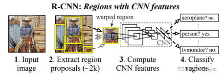

# R-CNN论文简单解读
## 模型架构

以现在的标准来看，模型相对来说比较简单。

流程分为四步：

1. 输入一张图片
2. 在图片上使用`选择性搜索（Selective Search, SS）`提取`2k`个`候选区域`
3. 对每一个候选区域都经过一个卷积神经网络，提取候选区域的特征（特征向量维度4096）
4. 对每个区域使用`SVM`分类器打分。对于图片中所有经过打分的候选区域，使用`非最大值抑制（Non-maxinum suppression, NMS）`剔除`IoU`小于阈值的区域。

## 特点
在当时，特征向量的维度更低，用时更少，能分类的类别数目更多，效果更好。

## 实验结果
比当时最好的结果高了30多个点，简直就是碾压。

rbg大佬的个人网站：https://www.rossgirshick.info/