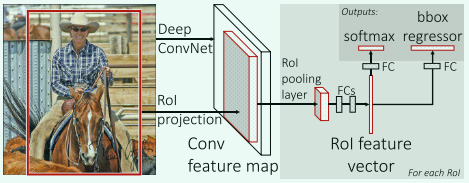
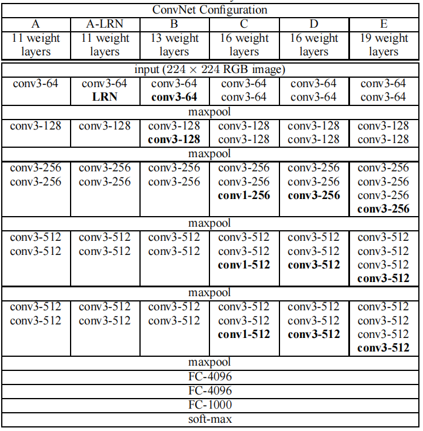
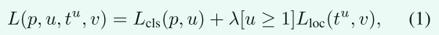
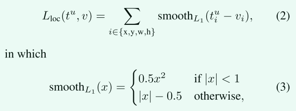
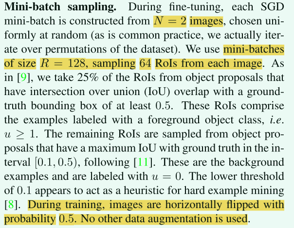
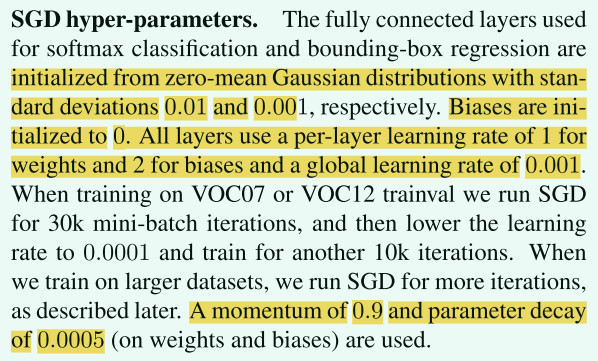

# Fast R-CNN论文简单解读

## 引言
名称由来：**Fast** **R**egion-based **C**onvolutional **N**eural **N**etwork (Fast R-CNN)

秀肌肉：Fast R-CNN比R-CNN快9倍，在测试时快213倍，在PASCAL VOC 2012上实现了更高的66%的mAP，比R-CNN高4个点。与SPPnet相比，Fast R-CNN训练VGG16的速度快3倍，测试速度快10倍，并且更准确。单张图片处理仅需0.3秒（不包括生成候选框的时间）

## 正文
检测本质上是定位+分类。分类问题相对而言，较为简单；复杂的部分在于检测需要**准确定位对象**，这带来了两个主要挑战。
（1）必须处理大量候选对象位置（通常称为“proposals”）
（2）候选框仅能提供粗略的定位，必须对其进行精修以实现精确定位

这些问题的解决方案通常会影响速度、准确性或简单性。

Fast R-CNN简化了当时效果最好的基于 ConvNet 的目标检测器的训练过程，即提出了一种单阶段训练算法，该算法不仅对候选框分类，同时对候选框进行精修。

### R-CNN的缺点
1、训练是多阶段的，比较繁琐。首先把ImageNet上面训练好的模型拿过来在目标检测的数据集上微调一下，其次训练SVM分类器，最后再学习边界框回归器（bounding-box regressors）
2、训练的时候占用空间多，速度慢。SVM分类器和边界框回归器需要的特征需要先存下来，一般会占用数百G的空间。提取特征使用的VGG16在VOC2007数据集上面需要2.5GPU-天
3、推理时间慢。使用VGG16，在GPU上面处理单张图片需要47秒

R-CNN慢就慢在处理候选对象的时候，一次只处理一个，没有共享计算。
> SPPnet通过共享计算提高了R-CNN的处理速度

### Fast R-CNN的优点
1、mAP高
2、训练是单阶段的，使用了多任务loss
3、SPPnet有部分卷积层不更新，我们可以更新网络里面的所有层
4、提取出来的特征不需要存下来

### 模型架构

模型输入：整个图像和一组建议对象（object proposals）

整体流程：
1、模型处理整张图片，产生一个特征图
2、把候选的对象（候选框）映射到特征图上面（RoI projection）
3、把候选框那部分对应的特征图提取出一个固定长度的特征向量，也就是一个7x7的特征图（RoI pooling layer）
4、后面接几个全连接层，同时接两个头，一个分类，一个对边界框进行回归

## 把VGG16调整成Fast R-CNN
先看一下VGG的结构

1、把最后一个池化层改成自适应池化层，输出特征图大小为固定的7x7大小
2、把最后一个全连接和softmax替换成两个子网络，一个分类，一个回归。分类的类别数应该是目标检测数据集的类别数加一（加背景这个类别）
3、把模型的输入改成图片+图片中的感兴趣区域（RoI）。

> 本人理解，RoI就是候选区域，也是候选框。不一定对，欢迎交流。

## 微调
先diss一波SPPnet
> R-CNN和SPPnet网络的训练模型时，每个训练样本（即RoI）来自不同的图像，这就是效率低下的根本原因。每个 RoI 可能有一个非常大的、跨越整个输入图像的感受野。由于前向传递必须处理整个感受野，因此训练输入很大（通常是整个图像）

Fast R-CNN提出了一种更有效的训练方法，该方法在训练期间利用特征的共享。 在 Fast RCNN 训练中，随机梯度下降 (SGD) 小批量是分层采样的，首先通过采样 N 个图像，然后通过从每个图像中采样 `R/N`个RoI， 来自同一图像的 RoI 在前向和后向传递中共享计算和内存。 使 N 变小会减少小批量计算。 例如，当使用 N = 2 和 R = 128 时，所提出的训练方案比从 128 个不同图像中采样一个 RoI 大约快 64 倍（即 R-CNN 和 SPPnet 策略）

因为来自同一图像的 RoI 是相关的，这种策略可能会导致训练收敛缓慢。 但是经过实验发现，这种担忧是不必要的，我们在 N = 2 和 R = 128 时使用比 R-CNN 更少的 SGD 迭代获得了良好的结果。

除了分层采样之外，Fast R-CNN 还使用了一个简化的训练过程，其中一个微调阶段联合优化了 softmax 分类器和边界框回归器，而不是在三个单独的阶段中训练 softmax 分类器、SVM 和回归器 。

### 多任务损失
Fast R-CNN有两个头，一个用来分类，一个用来回归。

分类头就是一般的图片分类，作用就是给每个RoI打个分，输出是`N+1`(类别数+背景）

回归器作用是微调边界框，输出形式是`t=(x, y, w, h)`，具体编码的时候，使用了`t`的参数化表示，每个类别一个框，也就是`N`个框（实现的时候为了简单，都直接N+1，看自己习惯了）
> detectron2框架就是N个框，N+1个分数，最后一个是背景类的分数，链接https://github.com/facebookresearch/detectron2/blob/main/detectron2/modeling/roi_heads/fast_rcnn.py

每个训练 RoI 都会指派一个真实类别 u 和一个真实边界框回归目标 v，损失定义如下：

第一项就是简单的分类损失，使用的log loss
第二项的方括号记号是艾佛森括号，如果真实类别是背景，也就是类别0，则值为0。换言之，如果是背景类，边界框的预测值是没有意义的，我们只计算分类损失。超参数λ是用来平衡这两个损失的，默认为1。
>“艾佛森括号”，是一种方括号记号，如果方括号内的条件满足则为1，不满足则为0。

第二项的具体公式如下：

> smooth L1 损失对异常值不敏感，比R-CNN的L2损失好

通过实验发现，这种联合损失对Fast R-CNN是最好的。

### Mini-batch采样策略
在微调过程中，先随机选择N=2个图像，然后从每个图像中采样64个ROI（R=128, 128÷2=64）

正样本：和真实边界框的IoU大于0.5的，取四分之一（这些框基本上一定有我们需要检测的类别）
负样本：从那些和任意真实的边界框的IoU在 [0.1, 0.5) 的区间内的里，再矮个子里面挑将军

> 为什么这么挑？
> 因为踩在巨人的肩膀上，参考别人的论文得到的

训练期间唯一的数据增强就是，以 0.5 的概率水平翻转图片。 

下面是采样策略部分论文原文：

### 其他的一些超参数

### 尺度不变性
多尺度方法通过图像金字塔为网络提供近似的尺度不变性。 在测试时，图像金字塔用于对每个候选区域进行近似尺度归一化。 在多尺度训练期间，每次采样图像时随机采样一个金字塔尺度。

## 推理（测试）
测试期间，R=2000。也就是一张图片会有2k个候选框，我们对每个类别分别进行最大值抑制，从而筛选出来最后的边界框。

## 实验结果
一句话，挺好的，就是现在可能大家都用Faster R-CNN了。