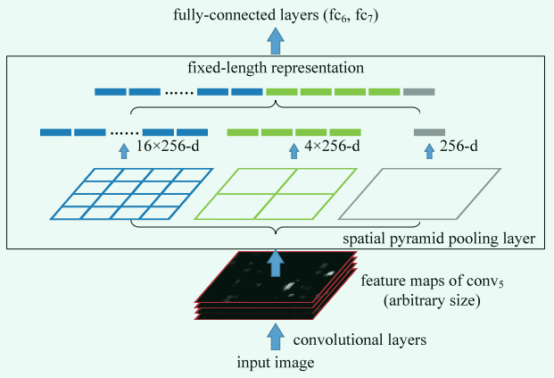
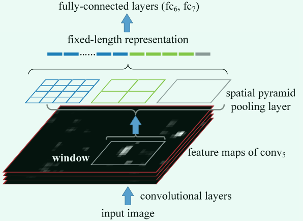
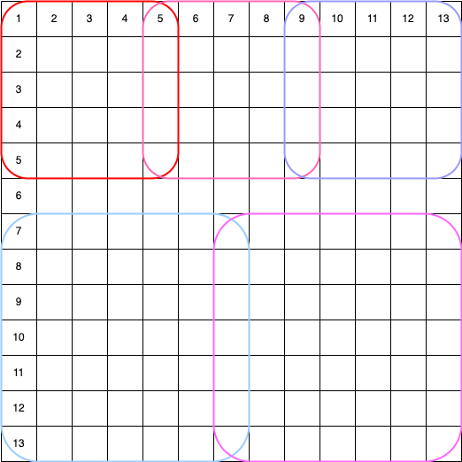

# SPP-net论文笔记
[论文原文](https://arxiv.org/abs/1406.4729)

## 总体概览
核心思路：空间金字塔池化。

以往做池化操作都是规定好池化窗口大小和步长，这样不同的特征图会得到不同的池化结果。

**空间金字塔池化**则是你对它说，我任意给你一张特征图，你还给我一个固定大小的特征图。

两张关键图：

1、分类的



2、目标检测的



分类和检测唯一的区别就是，分类把整个特征图喂给SPP池化层，目标检测只把RoI在特征图上的映射部分喂给SPP池化层。

最后一个问题，金字塔在哪？
>把1x1的，2x2的，3x3的......这些特征图摞起来，就是金字塔了 :dog2:

## 详细解读
先摆个数据：ImageNet2014挑战赛，目标检测第二名，图片分类第三名。

### 要解决的问题
传统的CNN模型只能处理固定大小的图片，如果图片大小改变了，就需要调整第一个FC层的输入通道数量。举个例子，vgg16模型会对图片下采样32倍，如果我们给一个224x224大小的图片，特征提取部分会得到一个7x7的特征图，我们再乘通道数512，得到了25088，也就是FC层神经元的个数。如果我们修改了图片的大小，特征提取部分得到的特征图的大小就会改变，这时我们就必须修改FC的输入通道数。

SPP-net就解决了这个问题。SPP-net 的网络结构可以生成固定长度的表示，而与图像大小无关。金字塔池对对象变形也很稳健。与R-CNN相比，SPP-net仅对图片计算一次特征图，然后在任意区域 (子图像) 中汇集特征以生成固定长度的表示形式来训练检测器。该方法避免了重复计算卷积特征。在处理测试图像时，我们的方法比R-CNN方法快24~102倍，同时在Pascal VOC 2007上获得更好的精度。

### 具体做法
在SPP-net中，使用滑动窗口实现空间金字塔池化。如果你有一张 AxA 的特征图，你想得到一个 NxN 的特征图，池化窗口的大小是 A/N 向上取整，步长是A/N 向下取整。特征金字塔有K层，我们就执行K次这样的操作。下面给一张图示意一下：




## 示例代码

```python
def spatial_pyramid_pooling(previous_conv, out_pool_size):
    """
    spatial pyramid pooling

    previous_conv: a tensor of previous convolution layer
    out_pool_size: a tuple of expected output size of max pooling layer, must start from 1

    returns: a tensor with shape [1 x n] is the concentration of multi-level pooling
    """
    num_sample = previous_conv.shape[0]  # batch size
    for i in out_pool_size:
        max_pool = nn.AdaptiveMaxPool2d(i)
        x = max_pool(previous_conv)
        if i == 1:
            spp = x.view(num_sample, -1)
        else:
            spp = torch.cat((spp, x.view(num_sample, -1)), 1)
    return spp
```
测试数据：
```python
previous_conv, out_pool_size = torch.rand((1, 512, 13, 13)), (1, 2, 4)
```
