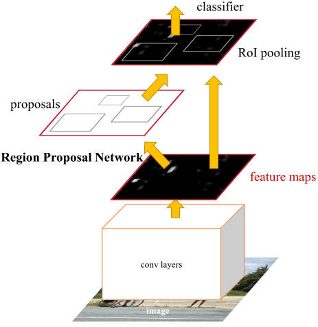
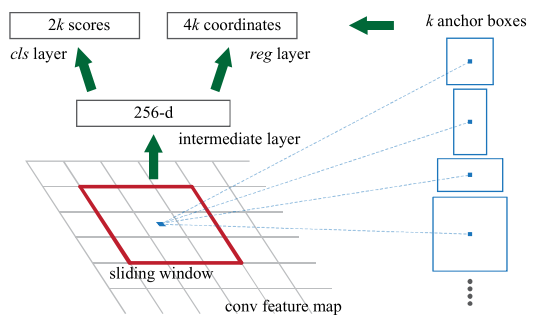
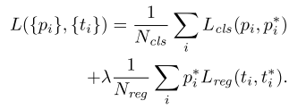
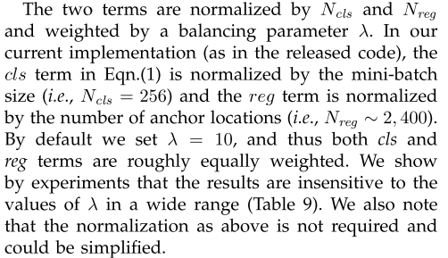
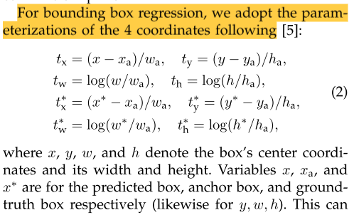
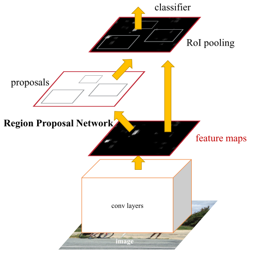

# Faster R-CNN论文笔记

## 引言
根据以往R-CNN系列的分析，现在影响网络性能的是候选区域提取的部分。比如SS算法，在CPU上处理一张图片大约要2秒。

文中提出了一种算法的改进——使用卷积神经网络来生成候选区域，命名为`Region Proposal Networks (RPN)`。RPN共享现有的目标检测网络的卷积层。这种方法既优雅又高效，几乎是 `cost-free` 的（每张图片在测试时大约10ms）。

> 使用VGG16作为主干网络，一秒大约处理5帧（张）图片

文中观察到，**基于区域的目标检测网络产生的特征图也可以用于生成候选区域**。 在这些卷积特征图的基础上，通过增加一些额外的卷积层来构造一个RPN。添加的这些卷积层在特征图的每个位置同时进行区域边界的回归以及是否有对象的打分判定。

RPN是一种全卷积网络(FCN)，可以通过端到端的训练，专门用于产生候选区域。 

RPN的设计是为了有效地预测具有广泛尺寸和纵横比的候选区域。 与使用图像金字塔或滤波器金字塔的方法不同，文中引入了**“锚框”**的概念，在多个尺度和纵横比下作为参考。

## 正文

网络分为两个模块：

1. RPN
2. Fast R-CNN

### RPN
RPN将任意大小的图像作为输入，然后输出一组矩形候选框，每个候选框都有一个对象性分数。

为了生成候选框，文中在最后一个共享卷积层输出的卷积特征图后面接一个小型网络。 

这个小型网络将特征图上的 n × n 窗口作为输入。 每个滑动窗口都映射到一个低维特征（ZF 为 256-d，VGG 为 512-d，随后是 ReLU 层）。 这个特征被输入到两个全连接层——一个回归层（reg）和一个分类层（cls）。 

文中使用 n = 3，注意输入图像上的有效感受野很大（ZF 和 VGG 分别为 171 和 228 像素）。 由于小网络以滑动窗口方式运行，因此全连接层在所有空间位置之间共享。 这种架构自然是用一个 n×n 卷积层和两个同级 1×1 卷积层（分别用于 reg 和 cls）来实现的。

> 这里的意思是说，用1 x 1 的卷积代替了全连接层

### Anchors
在每个滑动窗口的位置，同时预测多个候选区域，其中每个位置的最大的候选框的数量记为k。因此，reg层有4k个输出，cls层输出2k个分数（为每个候选框的有无对象的的概率，其实也可以只输出k个分数）。

k个候选区域是k个锚框（参考框）的参数化表示。锚点以滑动窗口为中心，并与尺度和高宽比相关联。默认情况下，我们使用3个尺度和3个长宽比，在每个滑动位置产生k=9个锚框。对于大小为W×H的特征图，总共有WHk锚点。

锚框是平移不变的。

锚点设计提出了一种解决多尺度（和纵横比）的新方案。基于anchor的方法是建立在anchors金字塔上的，更具成本效益。 文中的方法使用多尺度和纵横比的锚框对边界框进行分类和回归，仅依赖于单一尺度的图像和特征图，并使用单一尺寸的过滤器（特征图上的滑动窗口）

这种基于锚点的多尺度设计，可以简单地使用在单尺度图像上计算的卷积特征，就像 Fast R-CNN 检测器所做的那样。 多尺度锚框的设计是共享特征的关键组成部分。

### 损失函数
训练RPN时，每个框都会有一个二分类的标签（有待检测的物体，标签为1，没有则为0）。

分类成标签1（正样本）的标准：

1. 和真实的边界框的交并比（IoU）最大的那个或者那些
2. 和任意真实的边界框交并比大于0.7的那些（如果都小于0.7则条件一就显得很重要，不至于没有样本）

如果和所有真实的边界框的交并比小于0.3，则为负样本。非正非负的锚框直接扔掉。

$i$ 是锚框的索引，$p_i$是锚框$i$里面是否有感兴趣对象的预测值。$p_i^*$是真值（如果锚框是正样本，则为1，负样本为0）。$t_i$是预测出现的边界框的参数化表示，是一个4维的向量。$t_i^*$是边界框真实值的参数化表示。

其他细节：

坐标参数化表示的细节：

可以看做是锚框向真实边界框进行回归

> 也可以看做是平移加缩放的运算

### 训练RPN网络
RPN可以通过反向传播和随机梯度下降(SGD)进行端到端的训练

采样策略：以图像为中心

考虑到单个图像会产生很多的负样本，对所有锚框的损失函数进行优化会导致网络偏向负样本。我们在一幅图像中随机采样256个锚框来计算一个小批量的损失函数，其中采样的正负锚框的锚框比高达1：1。 如果一幅图像中的正样本少于128个，我们就用负样本填充。 

超参数设置：

1. 随机初始化所有的新层。随机值满足均值为0，方差为0.01的正态分布
2. 所有其他层使用ImageNet分类模型的预训练权重
3. 在VOC数据集上，对于前60K小批量，使用`1e-3`的学习率，对于接下来的20K小批量，使用`1e-4`的学习率
4. 动量为0.9，权重衰减`5e-4`

### Fast R-CNN和RPN的共享特征
接下来描述由 RPN 和 Fast R-CNN 组成的统一网络的算法，该网络具有共享的卷积层

独立训练的 RPN 和 Fast R-CNN 都会以不同的方式修改它们的卷积层。 因此需要开发一种技术，允许在两个网络之间共享卷积层，而不是学习两个单独的网络。 

论文使用**交替训练**的方法。

在这个方案中，我们首先训练 RPN，然后使用生成的候选区域来训练 Fast R-CNN。 然后用 Fast R-CNN 调优的网络来初始化 RPN，这个过程是迭代的。

其他的训练方法：

**近似联合训练**。 在此解决方案中，RPN 和 Fast R-CNN 网络在训练期间合并为一个网络。在每次 SGD 迭代中，前向传递生成候选区域（这些区域在训练Fast R-CNN检测器时被视为固定的、预先计算的区域）。反向传播像往常一样发生，对于共享层，来自 RPN 的损失和 Fast R-CNN 损失的反向传播信号被组合在一起。 

该解决方案易于实施。 但是这个解决方案忽略了候选框坐标的导数，所以是近似的。 在实验中，我们凭经验发现该方案产生了接近的结果，但与交替训练相比，训练时间减少了约 25-50%。 

> 感觉这个好一点，虽然损失了部分精度，但是训练时间大幅减少

4步交替训练。

1. 训练RPN。该网络使用ImageNet预训练模型进行初始化，并针对区域建议任务进行端到端微调。
2. 使用step-1 RPN生成的候选区域，通过Fast R-CNN训练一个单独的检测网络。该检测网络也由ImageNet预训练模型初始化。此时，两个网络不共享卷积层。
3. 使用检测器网络初始化RPN训练，但我们固定共享卷积层，只微调RPN特有的层。
4. 保持共享卷积层固定，对Fast R-CNN的唯一层进行微调。因此，两个网络共享相同的卷积层并形成统一的网络。

类似的交替训练可以运行更多的迭代，但论文观察到改进几乎是忽略不计的。

### 实现细节
1. 单尺度训练加推理
2. 把图像的最短边缩放到600像素
3. 锚框使用三个尺度（128x128，256x256，512x512），每个尺度长宽比三个比例（1:1，1:2，2:1）
4. 不使用图像金字塔或者滤波器金字塔来预测区域的多个尺度（节省时间）
5. 训练期间忽略跨越边界的锚框，不然在训练期间不收敛（对于1000x600的图片，这样处理之后大约剩余6k个锚框）
6. 测试期间的跨边界的锚框，把超过边界的部分裁掉
7. 使用`NMS`在过滤部分锚框，阈值0.7（这样的话训练的时候还能剩下大约2k个候选框）
8. 在NMS之后，再挑选top-k个框（k=2k）。也就是说，训练的时候有2k个候选框，测试的时候不一定

> 算法使用的锚框允许大于基础感受野。这样的预测并非不可能——如果只有物体的中间可见，人们仍然可以粗略地推断出物体的范围。

