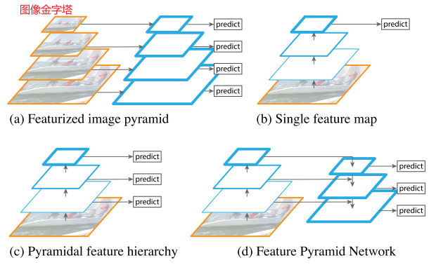
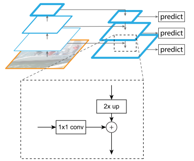
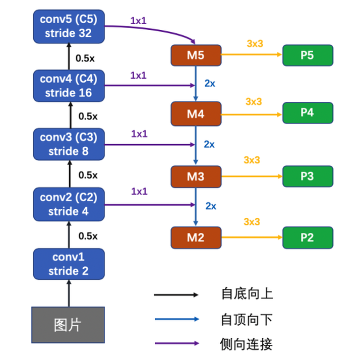
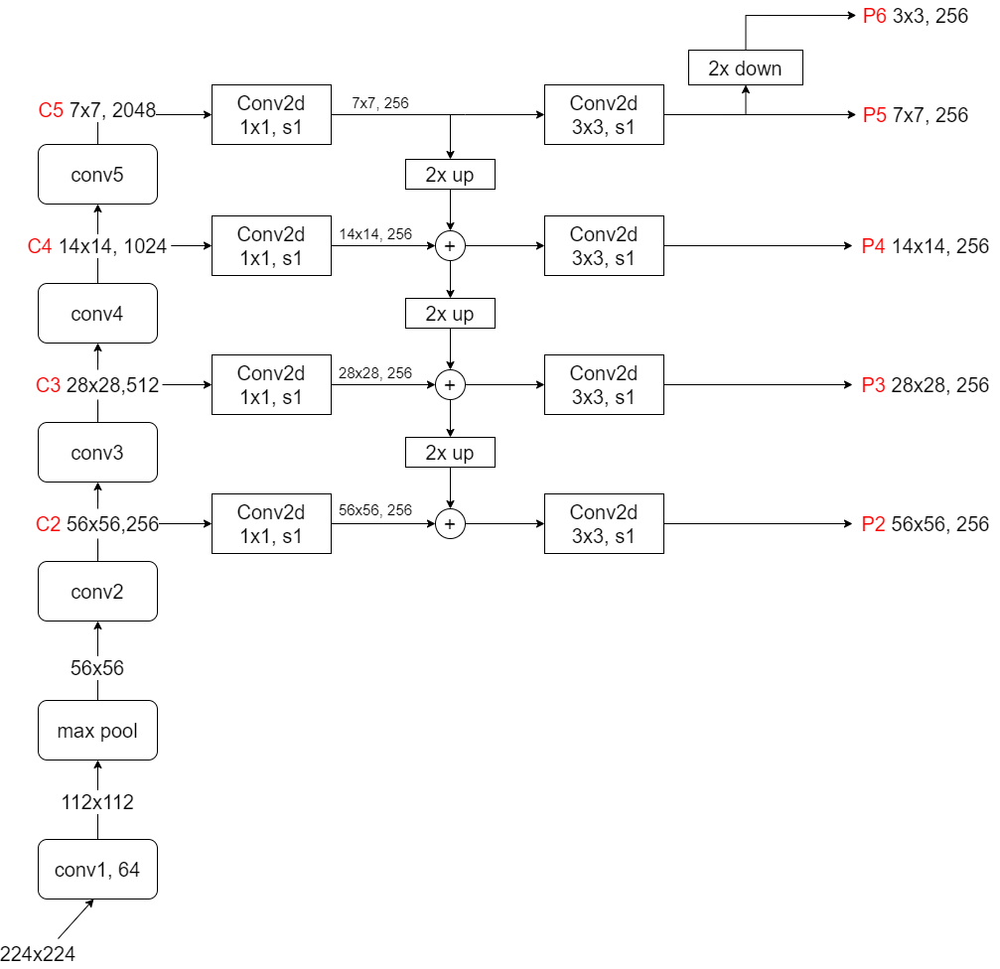

# FPN论文阅读

## 摘要

特征金字塔是识别系统中用于检测不同尺度对象的基本组件。

在本文中，我们利用深度卷积网络固有的多尺度金字塔层次结构来构建具有边际额外成本的特征金字塔。开发了一种具有横向连接的自上而下的架构，用于在所有尺度上构建高级语义特征图。这种称为特征金字塔网络 (FPN) 的架构在多个应用程序中作为通用特征提取器显示出显着的改进。在基本的 Faster R-CNN 系统中使用 FPN，我们的方法在 COCO 检测基准上实现了最先进的单模型结果。我们的方法可以在 GPU 上以 6 FPS 的速度运行。

## 前言

图像金字塔并不是计算多尺度特征表示的唯一方法。

本文的目标是自然地利用ConvNet特征层次的金字塔形状，同时创建在所有尺度上都具有强大语义的特征金字塔。为了实现这一目标，我们依赖一种通过自上而下的途径和横向连接，将低分辨率、语义强的特征与高分辨率、语义弱的特征相结合的体系结构。结果是一个在所有级别都具有丰富语义的特征金字塔，它可以从单个输入图像比例快速构建。换言之，我们展示了如何创建网络内特征金字塔，这些特征金字塔可以用来替换特征化的图像金字塔，而不牺牲表现力、速度或内存。

我们的方法利用架构作为特征金字塔，其中预测（例如，对象检测）在每个级别上独立进行。

我们的金字塔结构可以在所有尺度上进行端到端训练，并且在训练/测试时始终如一地使用，这对于使用图像金字塔来说是不可行的。这种改进是在不增加单尺度基线的测试时间的情况下实现的。

## FPN

我们的目标是利用 ConvNet 的金字塔特征层次结构（它具有从低到高的语义），并构建一个贯穿始终具有高级语义的特征金字塔。

我们的金字塔的构建涉及自下而上的路径、自上而下的路径和横向连接。

### 自下而上的路径

自下而上的路径是主干 ConvNet 的前馈计算，它计算由多个尺度的特征图组成的特征层次结构。

通常有许多层产生相同大小的输出图，我们说这些层处于同一网络阶段。对于我们的特征金字塔，我们为每个阶段定义一个金字塔级别。我们选择**每个阶段最后一层的输出**作为我们的参考特征图集，我们将对其进行丰富以创建我们的金字塔。

> 每个阶段的最深层应该具有最强的特征

具体而言，对于resnet，我们使用每个阶段的最后一个残差块的输出。

对于conv2、conv3、conv4和conv5的输出，我们将这些输出表示为{C2、C3、C4、C5}

> 由于conv1占用了大量内存，我们没有将其包括在金字塔中。

### 自上而下的路径和横向连接

自上而下的路径通过从更高的金字塔级别对空间上更粗糙但语义更强的特征图进行上采样来产生更高分辨率的特征。

通过横向连接使用自下而上路径的特征增强这些特征。每个横向连接从自下而上的路径和自上而下的路径合并相同空间大小的特征图。自下而上的特征图具有较低级别的语义，但它的激活更准确地定位，因为它的下采样次数更少

> 上采样策略：nearest neighbor upsampling

1x1的卷积是为了减少通道的维度，加法是直接相应位置的元素相加

我们在每个合并图上附加一个 3×3 的卷积来生成最终的特征图，这是为了减少上采样的锯齿效应。最后一组特征图称为{P2, P3, P4, P5}，对应于分别具有相同空间大小的{C2, C3, C4, C5}。

因为金字塔的所有级别都像传统的特征化图像金字塔一样使用共享分类器/回归器，所以我们在所有特征映射中固定特征维度（通道数，表示为d）。在本文中，我们设置d=256，因此所有额外的卷积层都有256个通道输出。在这些额外的层中没有非线性激活函数，我们经验发现这些层的影响很小。

将相同设计的头部（3×3 conv 和两个同级 1×1 convs）附加到特征金字塔的每个级别。 由于头部在所有金字塔级别的所有位置上密集滑动，因此没有必要在特定级别上具有多尺度锚点。 相反，我们将单个尺度的锚分配给每个级别。

头部的参数在所有特征金字塔级别上共享

自制图示例：

