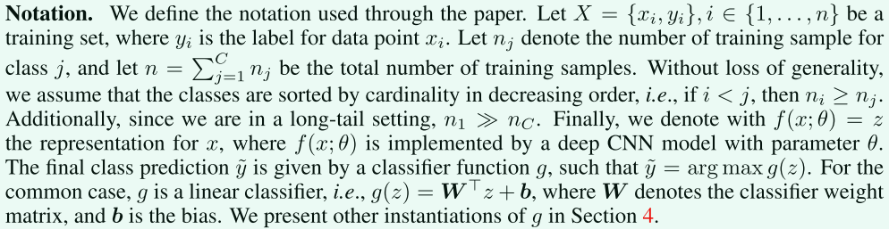
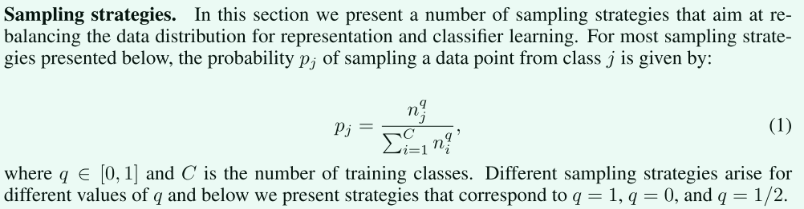
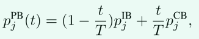
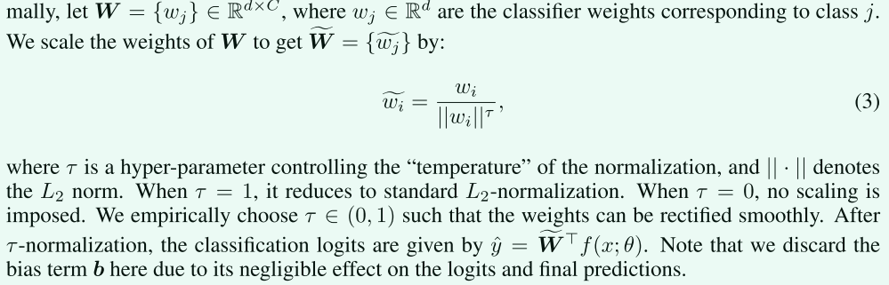
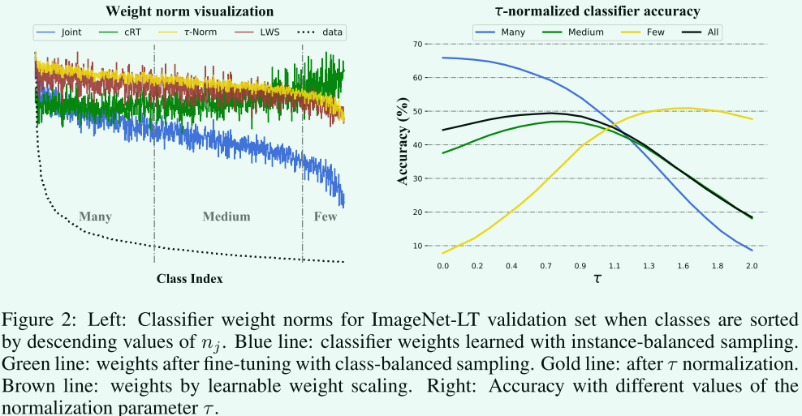
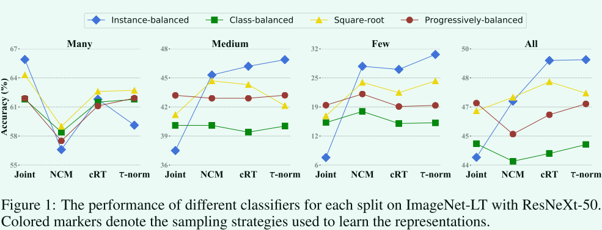
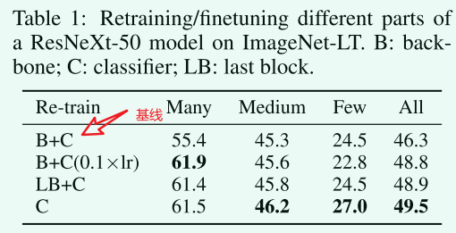

# Decoupling Representation and Classifier for Long-Tailed Recognition论文笔记
Facebook出品，ICLR2020会议论文，[官方代码](https://github.com/facebookresearch/classifier-balancing)
## 摘要
视觉世界的长尾分布对基于深度学习的**分类模型**提出了巨大的挑战，即如何处理类不平衡问题。现有的解决方案通常涉及类平衡策略，例如通过损失重新加权、数据重新采样，或将学习从头尾类转移到尾类，但**大多数方案都坚持联合学习表征和分类器的方案**。在这项工作中，**我们**将学习过程分解为**表征学习**和**分类**，并系统地探讨了不同的平衡策略对长尾识别的影响。研究结果令人惊讶：（1）数据不平衡可能不是学习高质量表征的问题；（2） 通过最简单的实例平衡（自然）采样学习表示，也可以通过仅调整分类器来实现强长尾识别能力。我们在ImageNet LT、Places LT和iNaturalist等常见长尾基准测试上进行了广泛的实验，并设定了最新的性能，结果表明，通过使用一种简单的方法，将表示和分类解耦，可以超越精心设计的损耗、采样策略，甚至是带有内存的复杂模块。
## 引言
现有方法背后的共同信念是：设计适当的采样策略、损失，甚至更复杂的模型，对于学习用于长尾识别的高质量表示很有用。

联合学习方案使得长尾识别能力是如何实现的尚不清楚——是通过学习更好的表示还是通过移动分类器决策边界更好地处理数据不平衡？ 

为了回答这个问题，我们将长尾识别与表征学习和分类分离。 对于表征（特征）学习，训练的样本直接喂给模型，并通过不同的采样策略或损失进行训练。 对于分类，根据学习到的特征，模型通过各种分类器识别长尾类。 我们评估了在联合和解耦学习方案下用于长尾识别的各种采样和分类器训练策略的性能。

具体来说，我们首先采用不同采样策略训练模型来学习特征，包括基于实例的采样、类平衡采样以及它们的混合。接下来，我们研究了三种不同的基本方法，以在学习到的特征的基础上获得具有平衡决策边界的分类器。
- 以类平衡的方式重新训练线性分类器（即重新采样）
- 非参数化的最临近类均值分类器，该分类器基于数据在训练集中最接近的特定于类的均值表示对数据进行分类
- 对分类器权重进行归一化，直接调整权重大小，使其更加平衡，并添加一个温度来调节归一化过程

实验结果：
- 我们发现，解耦表征学习和分类具有令人惊讶的结果，挑战了长尾识别的共同信念：实例平衡抽样学习到了最佳和最普遍的表征
- 在长尾识别中，在表征学习过程中重新调整联合学习分类器指定的决策边界是有利的：我们的实验表明，这可以通过使用类平衡采样重新训练分类器或通过简单但有效的，分类器权重归一化，它只有一个控制“温度”的超参数，不需要额外的训练
- 我们效果最好（当时最好）

## 相关工作
长尾学习主要有三个方向:
1. 数据分布重新平衡：过采样、欠采样、类平衡采样
2. 设计类别平衡的损失函数
3. 迁移学习：将从具有大量训练实例的头部类学习到的特征转移到特征不足的尾部类来解决训练数据不平衡的问题
## 学习长尾数据中的特征
我们真正感兴趣的是获得能够很好地识别所有类的模型。
各种重采样策略、损失重加权和边缘正则化等对于长尾识别，它们如何实现性能改进仍不清楚。 在这里，我们通过将特征学习与分类器学习分开来系统地研究它们的有效性，以确定对长尾识别真正重要的东西。
### 符号约定

### 采样策略

实例平衡采样：每个样本被选中的概率相同。$q=1$
类平衡采样：每个类别被选中的概率相同。$q=0$
平方根采样：$q=0.5$
渐进平衡采样： 随着学习的进行，在实例平衡和类平衡采样之间逐步“插值”。

> 参考了别人的混合采样策略：首先对多个 epoch 使用实例平衡采样，然后对最后一个 epoch 使用类平衡采样。
### 损失函数重加权策略
一些文章中的高性能的方法很难训练和重现，并且在许多情况下需要广泛的、特定于数据集的超参数调整
## 用于长尾识别的分类器
在平衡数据集上学习分类模型时，分类器权重 W 和 b 通常与模型参数 θ 联合训练，以通过最小化 真值和预测值之间的交叉熵损失来提取特征。 这也是长尾识别的典型基线。 尽管已经提出了从头到尾类重新采样、重新加权和迁移特征的各种方法，但总体方案保持不变：分类器要么与特征学习（比如一个提取特征的CNN网络）进行端到端的联合学习，要么通过两阶段方法，分类器和第一阶段通过类平衡策略得到的特征再联合微调

在本节中，我们考虑将特征提取与长尾识别中的分类器解耦。 我们提出了学习分类器的方法，旨在通过使用不同的采样策略或其他非参数方法（例如最近类均值分类器）进行微调来纠正头类和尾类的决策边界。 我们还考虑了一种重新平衡分类器权重的方法，该方法表现出高长尾识别精度，无需任何额外的训练。
### 分类器重新训练（Classifier Re-training，cRT）
一种最简单直接的方法是使用类平衡采样重新训练分类器。 
也就是说，冻结特征提取层，随机重新初始化和优化分类器权重 W 和 b，然后使用类平衡采样再训练几轮。 
### Nearest Class Mean classifier (NCM)
首先计算训练集上每个类的平均特征表示，然后使用余弦相似度或在L2归一化平均特征上计算的欧几里得距离执行最近邻搜索。
尽管它很简单，但这是一个很强的基线； 余弦相似性通过其固有的归一化减轻了权重不平衡问题 。
### τ-normalized classifier (τ-normalized)
我们研究了一种重新平衡分类器决策边界的有效方法，受经验观察的启发：在使用实例平衡采样进行联合训练后，权重$w_j$的范数与类$n_j$的基数相关，但是在使用类平衡采样对分类器进行微调之后，分类器权重的范数往往更加相似（参见图 2-左）
受上述观察的启发，我们考虑通过以下$\tau$归一化过程直接调整分类器权重规范来纠正决策边界的不平衡：
把第$i$类对应分类器的参数除这个类的范数

请注意，这里丢弃了偏差项 b，因为它对 logits 和最终预测的影响可以忽略不计。

蓝线：实例平衡采样
绿线：类平衡采样

### Learnable weight scaling (LWS)
上述策略的变体，冻结整个网络参数，找超参数
## 实验部分
### 实验结果分析

#### 联合训练时采样策略很重要。
联合训练时，渐进平衡采样最好。

实例平衡采样为头部类提供了最高性能。因为生成的模型高度偏向于头部类。
#### 联合训练还是解耦训练？
从图1结果来看，使用解耦方法在整体性能以及除了many shot情况外都明显更好。

可以看到，只重新训练分类头效果最好。

#### 实例平衡采样得到的特征最具有泛化性。
>这意味着数据不平衡可能不是学习高质量表示的问题。
## 总结
在这项工作中，我们探索了一些用于长尾识别的学习方案，并将联合学习表示和分类器与一些简单的解耦方法进行比较。 通过广泛的研究，我们发现虽然采样策略在联合学习表示和分类器时很重要，但实例平衡采样提供了更通用的表示，在适当地重新平衡分类器后可以实现最先进的性能，而无需精心设计 损失或记忆单位。 我们为三个长尾基准设置了新的最先进的性能，并相信我们的发现不仅有助于更深入地理解长尾识别任务，而且可以为未来的工作提供灵感。

