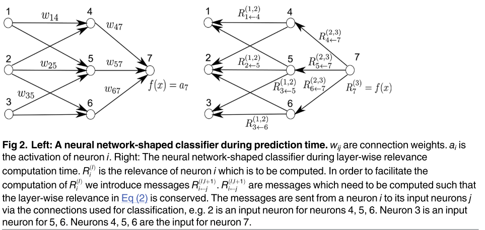

# On Pixel-Wise Explanations for Non-Linear Classifier Decisions by Layer-Wise Relevance Propagation

基于层级相关传播的非线性分类器决策的像素级解释

## 摘要

理解和解释自动图像分类系统的分类决策在许多应用中具有很高的价值，因为它允许验证系统的推理并向人类专家提供附加信息。尽管机器学习方法非常成功地解决了过多的任务，但在大多数情况下，它们的缺点是像一个黑箱，不能提供任何关于是什么让它们做出特定决定的信息。该工作提出了一种通过非线性分类器的逐像素分解来理解分类决策问题的通用解决方案。我们介绍了一种方法，该方法允许可视化单个像素对基于核的分类器在词袋特征和多层神经网络上的预测的贡献。这些像素贡献可以被可视化为热图，并且被提供给人类专家，该人类专家不仅可以直观地验证分类决策的有效性，而且还可以将进一步的分析集中在潜在感兴趣的区域上。我们评估了我们的方法，用于在Pascal VOC 2009图像、包含几何形状的合成图像数据、MNIST手写数字数据集上训练的分类器，以及作为Caffe开源包的一部分提供的预训练ImageNet模型。

## 引言

图像分类已成为许多计算机视觉应用的关键要素，例如 图像搜索 [1]、机器人 [2]、医学成像 [3]、雷达图像中的目标检测 [4] 或人脸检测 [5]。 两种特别流行的方法，神经网络 [6] 和词袋 (BoW) 模型 [7]，被广泛用于这些任务，并且在 ImageNet [8]、Pascal VOC [  9] 和 ImageCLEF [10]。 然而，与机器学习中的许多方法一样，这些模型通常缺乏对分类器预测的直接可解释性。 换句话说，分类器就像一个黑匣子，不提供关于它为什么会达到某个分类决策的详细信息。

缺乏可解释性是由于处理原始图像像素到其特征表示以及从处理到最终分类器函数的各种映射的非线性。这在分类应用中是一个相当大的缺点，因为它阻碍了人类专家仔细验证分类决策。在应用中，一个简单的是或否的答案有时是有限的价值，在这些应用中，诸如某物发生在哪里或它是如何构造的问题比仅存在或不存在特定结构的二进制或实值一维评估更相关。

在这项工作中，我们的目标是缩小多层神经网络和非线性核上的词袋（BOW）模型的分类和可解释性之间的差距，这两类预测器在计算机视觉中很受欢迎。我们将在一般意义上考虑这两种类型的预测器，尽可能避免对特定算法或映射的先验限制。对于第一部分，词袋模型将被视为图像中局部特征的非线性映射的集合，其中包括许多流行的映射方法，如Fisher向量[11]、正则化编码[12-14]和软编码[15]，结合可微分非线性核和一系列合并函数，包括总和合并和最大合并。对于第二部分，神经网络（例如[6，16]），我们将考虑具有任意连续神经元和基于广义p-均值的池化函数的一般多层网络结构。

下一节 Pixel-wise Decomposition as a General Concept 将解释分类器的逐像素分解的基本方法。 在重新审视词袋模型部分，我们将简要回顾词袋特征和基于内核的分类器并总结相关工作。 分解步骤的概述将讨论将基于核的分类器分解为图像小区域上的分数总和，以及向下投影到单个像素。 然后，我们的方法应用于各种映射和内核的示例部分中的许多流行的映射和内核。 多层网络的逐像素分解将逐像素分解作为一般概念中解释的基于泰勒和逐层相关传播方法应用于神经网络架构。 我们的框架的实验评估将在实验中完成，我们在讨论中以讨论结束本文。

## Pixel-wise Decomposition as a General Concept

按像素分解的总体思想是了解图像x的单个像素对分类器在图像分类任务中做出的预测f(x) 的贡献。我们想分别为每个图像x找出哪些像素在多大程度上对正或负分类结果做出了贡献。此外，我们希望通过度量来定量地表达这种程度。我们假设分类器具有被阈值为零的实值输出。在这样的设置中，它是映射f: RV!R1，使得f(x)&gt; 0表示存在学习的结构。可以通过减去0.5来处理概率输出而不会损失一般性。我们有兴趣找出输入图像x的每个输入像素x(d) 对特定预测f(x) 的贡献。特定于分类的重要约束包括找到相对于分类的最大不确定性状态的微分贡献，然后由f(x0) = 0的集合表示。一种可能的方法是将预测f(x) 分解为分别为输入维度xd像素的项之和
$$
f(x) \approx \sum_{d=1}^{V} R_{d}
$$
定性解释是Rd &lt;0提供了反对要分类的结构的证据，而Rd&gt; 0提供了其存在的证据。就随后的可视化而言，这将不是本文的范围，可以将每个输入像素x(d) 的结果相关性Rd映射到颜色空间，并以这种方式可视化为常规热图。在以下工作中，一个基本限制是Rd的标志应遵循上述定性解释，即正值应表示正贡献，负值应表示负贡献。图1描述了我们方法的主要思想。

在本文中，我们提出了一个新的概念，我们称之为逐层相关性传播，作为一个通用概念，用于实现如方程（1）中的逐像素分解。我们还讨论了一种基于Taylor分解的方法，该方法产生了逐层相关性传播的近似。我们将证明，对于广泛的非线性分类架构，可以在不需要使用泰勒展开近似的情况下进行逐层相关性传播。我们在本文中提出的方法不涉及分割。它们不需要像素训练作为学习设置，也不需要像素标记用于训练阶段。这里使用的设置是图像分类，其中在训练期间为作为整体的图像提供一个标签，然而，本文的贡献不是关于分类器训练。所提出的方法建立在预先训练的分类器之上。它们甚至适用于已经预先训练的图像分类器，如“ 1000个ILSVRC类的神经网络”一节所示。

## 逐层相关性传播

我们将介绍逐层相关性传播作为由一组约束定义的概念。满足约束的任何解决方案将被认为遵循逐层相关性传播的概念。在后面的章节中，我们将推导出两个特定分类器架构的解决方案，并通过实验评估这些解决方案的意义。一般形式的逐层相关性传播假设分类器可以分解为几个计算层。这样的层可以是从图像中提取的特征的一部分，或者是在计算的特征上运行的分类算法的一部分。如后面所示，这对于具有非线性SVM的词袋特征以及神经网络是可能的。

第一层是输入,图像的像素,最后一层是实值预测输出分类器f。11届层被建模为一个向量z¼¼ðzðlÞÞVðlÞd d 1与维度V (l)。Layer-wise相关性传播假定我们有一个相关性得分Rðlþ1Þ每个维度zðlþ1Þd每个维度zðlÞ向量z l层+ 1。这个想法是为了找到一个相关性得分RðlÞd d向量z在下一层l是接近输入层,下面的方程。
$$
f(x)=\cdots=\sum_{d \in l+1} R_{d}^{(l+1)}=\sum_{d \in l} R_{d}^{(l)}=\cdots=\sum_{d} R_{d}^{(1)}
$$
从作为分类器输出 f(x) 的最后一层迭代方程 (2) 到由图像像素组成的输入层 x，然后产生所需的方程 (1)。 输入层的相关性将作为等式 (1) 中所需的总和分解。 在下文中，我们将推导出方程 (1) 和 (2) 之外的进一步约束，并通过示例来激励它们。 正如我们现在将展示的，满足等式（2）的分解本身既不是唯一的，也不能保证它对分类器预测产生有意义的解释。

我们给出一个简单的反例。假设我们有一层。输入为x 2 RV。我们使用了一个线性分类器，该分类器具有一些任意的和特定维度的特征空间映射
$$
f(x)=b+\sum_{d} \alpha_{d} \phi_{d}\left(x_{d}\right)
$$
让我们将第二层的相关性定义为 $R_{1}^{(2)}=f(x)$。 然后，一种可能的逐层相关性传播公式是将输入 x 的相关性 R(1) 定义为
$$
R_{d}^{(1)}= \begin{cases}f(x) \frac{\left|\alpha_{d} \phi_{d}\left(x_{d}\right)\right|}{\sum_{d}\left|\alpha_{d} \phi_{d}\left(x_{d}\right)\right|} & \text { if } \sum_{d}\left|\alpha_{d} \phi_{d}\left(x_{d}\right)\right| \neq 0 \\ \frac{b}{V} & \text { if } \sum_{d}\left|\alpha_{d} \phi_{d}\left(x_{d}\right)\right|=0\end{cases}
$$
这显然满足方程 (1) 和 (2)，但是所有输入维度的相关性 $R^{(1)}(x_{d})$ 与预测 $f(x)$ 具有相同的符号。 在逐像素分解解释方面，如果 $f(x) > 0$，则所有输入都指向结构的存在，如果 $f(x) < 0$，则指向结构的缺失。这对于许多分类问题来说不是一个现实的解释。

让我们讨论一种更有意义的方式来定义逐层相关性传播。 对于这个例子，我们定义
$$
R_{d}^{(1)}=\frac{b}{V}+\alpha_{d} \phi_{d}\left(x_{d}\right)
$$
然后，特征维度 xd 的相关性取决于等式 (5) 中项的符号。 这是对许多分类问题的一种更合理的解释。 第二个例子表明，逐层相关传播能够在一定程度上处理非线性特征空间映射 φd 以及满足公式（2）的逐层相关传播的例子在实践中的样子。 请注意，这里根本不需要对特征空间映射 φd 进行规律性假设，它甚至可能是不连续的，或者在 Lebesgue 度量下是不可测量的。 基本公式（2）可以解释为特征处理层之间相关性R的守恒定律。

上面的例子进一步给出了关于什么是相关性 R 的直觉，即对预测函数 f(x) 的局部贡献。 从这个意义上说，输出层的相关性就是预测本身 f(x)。 第一个示例显示了对于线性情况的分解可以期待什么。 线性案例并不新鲜，但是，它提供了第一直觉。

我们给出第二个更图形化和非线性的例子。 图 2 的左图显示了一个神经网络形状的分类器，其中包含神经元和神经元之间连接的权重 wij。 每个神经元 i 都有一个来自激活函数的输出 ai。

顶层由一个输出神经元组成，索引为 7。对于每个神经元 i，我们想计算一个相关性 Ri。 我们将顶层相关性 $R_{7}^{(3)}$ 初始化为函数值，因此 $R_{7}^{(3)}=f(x)$。 等式（2）中的逐层相关性传播现在需要保持
$$
\begin{gathered}
R_{7}^{(3)}=R_{4}^{(2)}+R_{5}^{(2)}+R_{6}^{(2)} \\
R_{4}^{(2)}+R_{5}^{(2)}+R_{6}^{(2)}=R_{1}^{(1)}+R_{2}^{(1)}+R_{3}^{(1)}
\end{gathered}
$$